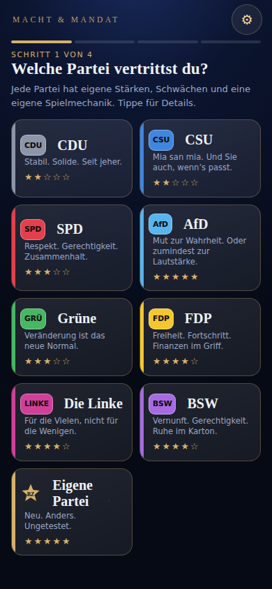
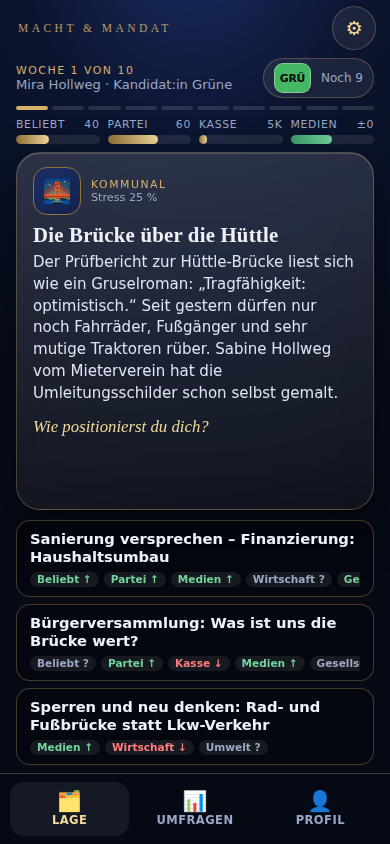
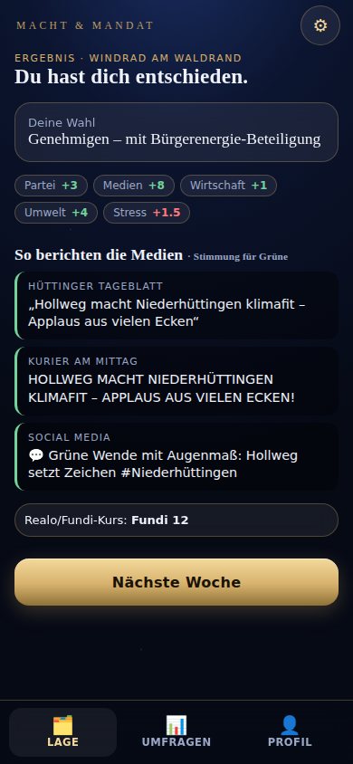
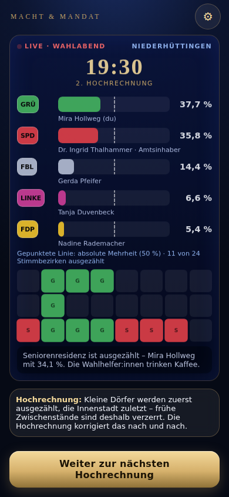
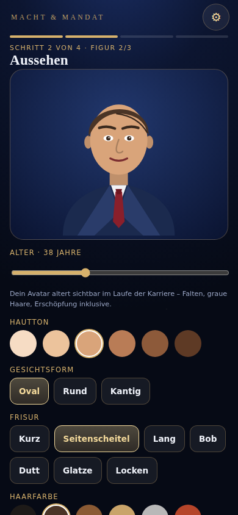
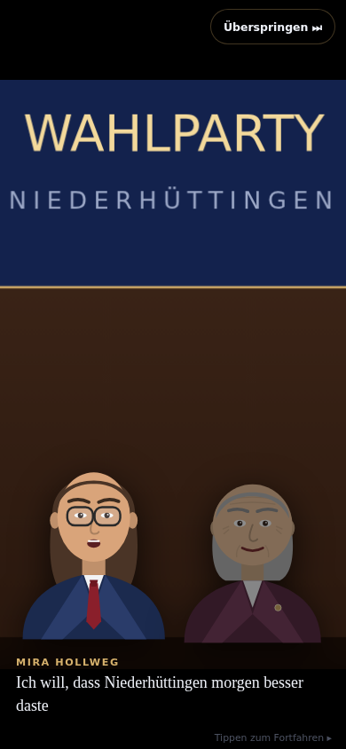
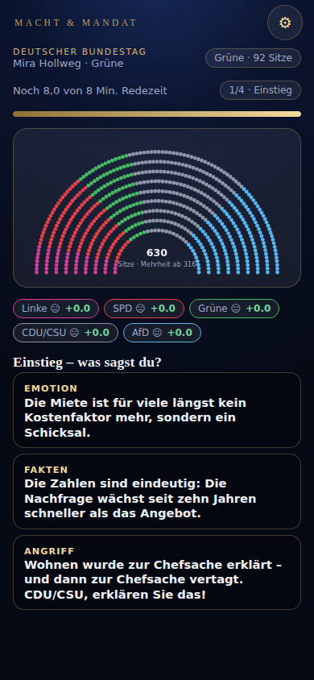
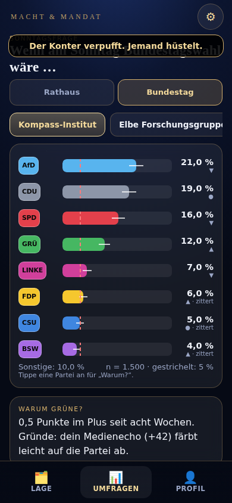

# Macht & Mandat – Vom Rathaus ins Kanzleramt

Mobile-first Politik-Karrierespiel mit deutschem Setting: Lokalpolitiker:in → Bürgermeister:in → Landtag → Bundestag → Kanzleramt.
Dieses Verzeichnis enthält das **Game-Design-Dokument (Kapitel 1–14)**, die **Datenbasis und Werkzeuge** und einen **spielbaren mobilen Prototyp**.

> Alle Figuren, Orte, Medien und Institute sind **fiktiv**. Parteien sind **stilisiert und satirisch überhöht** dargestellt, ohne Wahlempfehlung. Keine echten lebenden Politiker:innen.

## Spielbarer Prototyp (Auftrag 15)

**▶ `prototype/index.html`** – eine einzige, offlinefähige Datei (kein Build, keine Abhängigkeiten, keine Fremdfonts). Im Smartphone-Browser öffnen oder lokal per Doppelklick.

Enthalten (alles spielbar, Hochformat, Ein-Daumen-Bedienung, Auto-Save):

| Baustein | Inhalt |
|---|---|
| **Startbildschirm** | Neue Karriere, Fortsetzen (Auto-Save), Anleitung, Einstellungen (Schriftgröße, Hoher Kontrast, Farbenblind-Modus, Haptik, Sprachausgabe, Reduce-Motion) |
| **Parteiwahl** | CDU, CSU, SPD, AfD, Grüne, FDP, Linke, BSW + **Eigene Partei** (Editor: Name, Kürzel, Logo, Farbe, Themenregler, Startkapital); je Partei Stärken, Schwächen, Mechanik |
| **Avatar-Erstellung** | parametrischer SVG-Avatar (Hautton, Gesicht, Frisur, Kleidung, Accessoire, Alter), 8 Berufe mit Startboni, Herkunft, Dialekt, 7 Attribute mit freien Punkten |
| **Kampagne** | Slogan (auch frei), Budgetverteilung auf 5 Kanäle mit Zielgruppen-Wirkung |
| **Erste Bürgermeisterwahl** | Niederhüttingen (38 400 Einw., 6 Milieus, 24 Stimmbezirke), 5 Kandidat:innen, Stichwahl, Wahlabend |
| **10 Entscheidungskarten** | aus 16 Kern-Events per Generator-Gewichtung; Vorschau-Pfeile (Berater-Qualität), Wagnisse, Wisch-Karte, Schmetterlingseffekte, parteiabhängige Medienreaktionen |
| **Sonntagsfrage-Screen** | Rathaus + Bund, 3 fiktive Institute mit Hauseffekten und Fehlertoleranz, Trendkurven, „Warum?“, Sitzverteilung im Plenarsaal, mögliche Mehrheiten |
| **Bundestagsrede-Minispiel** | 3 Themen × 3 Tonfälle, 4 Redeabschnitte, Zwischenrufe (Zeitdruck), Beifall je Fraktion, Ordnungsruf, Wertung |
| **Wahlabend-Hochrechnung** | Prognose 18:00, 4 Hochrechnungen, Bezirks-Raster, Ticker, Elefantenrunde, Stichwahl |
| **Cutscenes** | Kandidatur, Elefantenrunde, Amtseid, Niederlage, Stichwahl – Kamerafahrten, Untertitel, Eilmeldungsband, optionale Sprachausgabe, überspringbar |

*Direktzugriff für Tests:* Zahnrad → „Prototyp-Module“ (Sonntagsfrage, Bundestagsrede, Wahlabend).

**Als App installieren / Offline-Modus:** Auf `http(s)` ausgeliefert (z. B. `npx http-server macht-und-mandat/prototype`) registriert sich der Service-Worker (`sw.js`) und die Seite lässt sich als PWA installieren.

**Neu bauen:** `node tools/build-prototype.js` fügt `prototype/src/` (CSS + 13 JS-Module) zu `prototype/index.html` zusammen.

### Screenshots

| Parteiwahl | Entscheidungskarte | Ergebnis & Medien | Wahlabend |
|---|---|---|---|
|  |  |  |  |

| Avatar | Cutscene | Bundestagsrede | Sonntagsfrage Bund |
|---|---|---|---|
|  |  |  |  |

## Dokumentation (Aufträge 1–14)

| Auftrag | Inhalt | Datei |
|---|---|---|
| 1 · 2 | GDD: Überblick, Zielgruppe, USP · Kernspielschleife, Progressionsdiagramm | [`docs/01-gdd-kernschleife.md`](docs/01-gdd-kernschleife.md) |
| 3 | Parteienprofile inkl. Mechaniken (9 Parteien) | [`docs/02-parteienprofile.md`](docs/02-parteienprofile.md) |
| 4 | Beispiel-Ereigniskatalog: 20 Events mit Optionen und Folgen | [`docs/03-ereigniskatalog.md`](docs/03-ereigniskatalog.md) |
| 5 | Wahlkampf- und Koalitionsmechanik mit Formeln und Werten | [`docs/04-wahlkampf-koalition.md`](docs/04-wahlkampf-koalition.md) |
| 6 | Bundestags- und Umfragesystem mit Formeln und Werten | [`docs/05-bundestag-umfragen.md`](docs/05-bundestag-umfragen.md) |
| 7 · 8 · 9 | Ereignis-Generator · 50 Templates · Rechenbeispiel 3 000 → 30 000+ | [`docs/06-ereignis-generator.md`](docs/06-ereignis-generator.md) |
| 10 | Balancing-Konzept (Umfragen, Wahlergebnisse, Mehrheiten) – messbasiert | [`docs/07-balancing.md`](docs/07-balancing.md) |
| 11 · 12 | UI/UX-Konzept mit Wireframes · Cutscene-Drehbuch (3 Schlüsselmomente) | [`docs/08-ux-cutscenes.md`](docs/08-ux-cutscenes.md) |
| 13 · 14 | Technische Architektur & Datenmodell · Roadmap | [`docs/09-technik-roadmap.md`](docs/09-technik-roadmap.md) |

## Daten und Werkzeuge

| Pfad | Zweck |
|---|---|
| `data/pools.json` | 24 Variablen-Pools (Orte 2 880, Personen 3 100, Firmen 3 000, …) |
| `data/templates50.json` | 50 Ereignis-Templates (je ≥ 12 Textvarianten) |
| `tools/eventgen.js` | Referenz-Engine: Slots, Gewichtung, Wiederholungssperre, Gedächtnis, Glückssaldo, Ketten, Lint |
| `tools/stats.js` | Kombinatorik- und 20-Stunden-Simulation (Kapitel 9) |
| `tools/balance-sim.js` | Monte Carlo: Umfragen → Wahl → Sitze → Mehrheiten (Kapitel 10) |
| `tools/balance-prototype.js` | lässt den Prototyp headless 400× je Partei durchspielen (Zufall vs. geschickt) |
| `tools/tune-prototype.js` | kalibriert die Schwierigkeits-Offsets je Partei |
| `tools/examples.js` | Rechenbeispiele: Sitzverteilung, Überhang/Ausgleich, Wählerwanderung (IPF), Shapley-Shubik, Ministerienverteilung |
| `tools/make-event-catalog.js`, `make-template-table.js` | erzeugen Katalog und Template-Tabelle aus den echten Daten |
| `docs/_generated/` | Rohausgaben der Werkzeuge (Quelle der Zahlen in den Kapiteln) |

```bash
node tools/stats.js                    # Varianten-Zählung + 20-h-Simulation
node tools/balance-sim.js 10000        # Bundes-Monte-Carlo
node tools/examples.js                 # Rechenbeispiele
node tools/build-prototype.js          # Prototyp neu zusammensetzen
CHROMIUM_PATH=/pfad/zu/chrome node tools/balance-prototype.js '{"skilled":1}'   # benötigt Playwright + Chromium
```

## Was der Prototyp bewusst *nicht* enthält

Landtag, Kanzlerwahlkampf, Koalitionsverhandlung, Gesetzeseditor, Plakat-/Spot-Editor, TV-Duell-Minispiel, Sankey-Diagramm, Skillbaum, Sprachaufnahmen und Musik. Sie sind in den Kapiteln 5–6, 11–14 spezifiziert (Formeln, Werte, Screens, Roadmap) und für den Vertical Slice vorgesehen.
