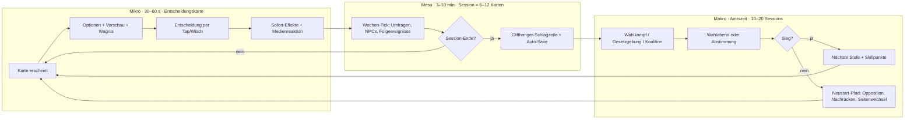
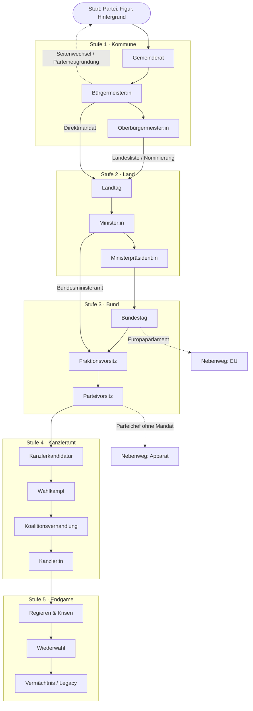

# 1 · Game-Design-Dokument: Überblick, Zielgruppe, USP
# 2 · Kernspielschleife und Progressionsdiagramm

> **Arbeitstitel:** *Macht & Mandat – Vom Rathaus ins Kanzleramt*
> **Status:** GDD v0.1 · begleitet den spielbaren Prototyp (`prototype/index.html`) · alle Figuren, Orte und Institute sind fiktiv.

---

## 1.1 Elevator Pitch

Du startest als Lokalpolitiker:in in der fiktiven Stadt *Niederhüttingen* – 38 400 Einwohner:innen, drei Kreisverkehre, ein Kita-Notstand. Mit jeder Entscheidung, jedem Versprechen und jeder Schlagzeile arbeitest du dich über Bürgermeisteramt, Landtag und Bundestag bis ins Kanzleramt hoch. Deine Partei, deine Geschichte und dein Umfeld formen, wie sich dieselbe Lage anfühlt: Eine Brückensanierung ist bei der SPD ein „Investitionsversprechen“, bei der FDP „Schuldenpolitik“, bei der AfD eine „Gelegenheit, die Bürgernähe zu beweisen“ – und beim Boulevard immer ein Skandal.

Das Spiel ist **Karriere-Simulation, Kartendrama und Wahlabend-Thriller** in einem: kurze Sessions (3–10 Minuten), echte Konsequenzen (auch nach Jahren), satirischer Ton ohne Hetze.

## 1.2 Design-Säulen

| Säule | Bedeutung | Konsequenz im Design |
|---|---|---|
| **1 · Jede Entscheidung hat ein Echo** | Kurz- *und* langfristige Folgen, Schmetterlingseffekte, Versprechen, die eingefordert werden | Ereignisketten, Gedächtnis des Spiels, Versprechens-Register, verzögerte Effekte |
| **2 · Gleiche Lage, andere Welt** | Jede Partei erlebt dieselben Ereignisse anders | Parteispezifische Mechaniken, Medienreaktionen, Startsituationen, Koalitionssperren |
| **3 · Glaubwürdig-satirisch** | Realistische Mechanik, überhöhte Situationskomik, nie hetzerisch | Fiktive Figuren, faire Darstellung aller Parteien, Humor auf Kosten von Verfahren und Eitelkeiten statt von Gruppen |
| **4 · Daumen-Drama in 5 Minuten** | Mobile first, Ein-Daumen-Bedienung, jede Session endet mit einem Haken | Kartenlauf mit 6–12 Karten, Auto-Save, Cliffhanger-Schlagzeile am Ende jeder Session |
| **5 · Jedes Mal anders** | Prozedurale Ereignisse statt Skript, faire Zufallsverteilung | Generator mit ≥ 30 000 wahrnehmbar verschiedenen Ereignissen (Kapitel 7–9) |

## 1.3 Zielgruppe

| Persona | Alter | Motiv | Sessionmuster | Was sie braucht |
|---|---|---|---|---|
| **Die Pendlerin** (Kernzielgruppe) | 25–45 | Kurzweil in Bahn & Mittagspause, Interesse an Politik ohne Fachjargon | 3–8 Min., 2–3× täglich | Einhand, Auto-Save, klarer Cliffhanger |
| **Der Strategie-Fan** | 18–40 | Systeme durchdringen, Koalitionsmathematik, Bestwerte | 15–40 Min., Wochenende | Tiefe: Gesetzesentwürfe, Sitzverteilung, Szenarien |
| **Die Satire-Leserin** | 20–55 | Humor über Politikbetrieb, Schlagzeilen, Memes | 5–10 Min. | Gute Texte, Überraschungen, teilbare Momente |
| **Der Lehrer / die Politik-Interessierte** | 16–60 | Verständnis Wahlsystem, Gesetzgebung | sporadisch | Nachvollziehbare Regeln, Erklärungen („Warum fällt die Partei?“) |

**Jugendschutz / Einstufung (Ziel):** USK 6–12, keine Gewalt, Politik-Satire ohne Hassinhalte, keine echten lebenden Politiker:innen.

## 1.4 USP (Alleinstellung)

| # | USP | Gegenüber typischen Wahl-/Politik-Sims |
|---|---|---|
| 1 | **Deutsches Wahl- und Parlamentssystem in spielbarer Tiefe** (Erst-/Zweitstimme, 5-%-Hürde, Grundmandatsklausel, Sainte-Laguë, Bundesrat, Vermittlungsausschuss, Vertrauensfrage) | Meist US-zentriert oder stark vereinfacht |
| 2 | **Neun Parteien, neun Spielweisen** inklusive eigener Parteigründung | Meist austauschbare „Partei-Skins“ |
| 3 | **Medien reagieren parteiabhängig** (Lokalblatt, Boulevard, Social Media) | Meist ein globaler „Beliebtheits“-Wert |
| 4 | **Schmetterlings-Engine:** Entscheidungen kehren zurück, Versprechen werden eingefordert | Meist isolierte Zufallsereignisse |
| 5 | **Wahlabend als Höhepunkt:** Prognose 18:00 Uhr, Hochrechnungen mit realistischem Auszählungsverzerrung, Elefantenrunde | Meist nur ein Ergebnisbildschirm |
| 6 | **Premium-Look & Ton** (dunkle Eleganz, Serifen, Gold/Marine, Glas-Effekte) bei satirischem Text | Meist Flash-Optik oder Trockenheit |
| 7 | **Fair & ohne Pay-to-Win** | Häufig Energie-/Wartezeit-Modelle |

## 1.5 Plattform & Design-Prinzipien

| Thema | Entscheidung |
|---|---|
| Plattform | iOS & Android (Hochformat), danach Tablet-Layout, optional Web/PC |
| Session | 3–10 Minuten, automatisches Speichern nach jeder Entscheidung, vollständig offline |
| Bedienung | Ein-Daumen: Hauptaktionen im unteren Drittel, Wisch-Gesten nur als *Zusatz* (immer mit Button-Alternative) |
| Look | dunkle Eleganz · Marineblau `#060a15–#13224d` · Gold `#d6b16c` · Serifen-Typografie · Glas-Panels · weiche Animationen · Haptik |
| Barrierearm | Touch-Ziele ≥ 48 dp, skalierbare Schrift (13–24 px), Kontrast-Modus, Farbenblind-Modus (Okabe-Ito + Muster + Kürzel), Untertitel überall, Reduce-Motion, Sprachausgabe optional |
| Sprache | Deutsch, Text in `gettext`/CSV-Tabellen → Englisch später ohne Codeänderung |
| Ton | natürliches, leicht satirisches Deutsch; Pointen auf Kosten von Verfahren, Eitelkeit, Bürokratie; keine Herabwürdigung von Gruppen |
| Figuren | ausschließlich fiktive Personen (Namens-Kombinatorik); Parteien stilisiert; „BSW“ wird im Spiel fiktiv ausgeschrieben, weil der Originalname eine lebende Person enthält |
| Monetarisierung | Einmalkauf (Vollversion) **oder** kostenlos mit kosmetischen Paketen (Avatar-Outfits, Plakat-Themes, Parteilogos). **Kein Pay-to-Win**, keine Energiesysteme, keine Loot-Boxen |

## 1.6 Kernwerte des Spielsystems (Überblick)

| Wert | Bereich | Bedeutung | Wirkt auf |
|---|---|---|---|
| **Beliebtheit** | 0–100 | Persönlicher Zuspruch | Wahlergebnis, Kanzlerpräferenz |
| **Parteiloyalität** | 0–100 | Rückhalt der Partei | Nominierung, Fraktionsdisziplin, Parteitage |
| **Kasse** | k€ / Mio. € / Mrd. € je Ebene | Kampagnenbudget bzw. Haushaltsspielraum | Werbung, Optionen mit Kosten |
| **Medienecho** | −100…+100 | Tonlage der Berichterstattung | Bekanntheit, Skandalverstärkung |
| **Wirtschaft / Umwelt / Gesellschaftsklima** | 0–100 | Zustand der „Welt“ | Umfragen, Ereignisauswahl, Legacy |
| **Stress** | 0–100 | Belastung der Figur | Erfolgschancen, Gesundheit, Familie |
| **Koalitionsstabilität** | 0–100 | Zustand der Regierung | Regierungskrisen, Vertrauensfrage |
| **Sieben Attribute** | 10–95 | Charisma, Intelligenz, Durchsetzung, Integrität, Medienwirkung, Belastbarkeit, Netzwerk | Wagnisse, Vorschau-Qualität, Dialog-Minispiele |
| **Beziehungen (NPCs)** | 0–100 | Berater:innen, Rivalen, Journalist:innen, Partner, Lobbyisten, Familie | Hilfe, Intrigen, Enthüllungen |
| **Legacy-Score** | 0–100 | Bilanz der Laufbahn | Endbewertung, Ranglisten |

---

# 2 · Kernspielschleife

## 2.1 Drei ineinandergreifende Schleifen

| Schleife | Dauer | Spielerhandlung | Belohnung | Rückkopplung |
|---|---|---|---|---|
| **Mikro** | 30–60 s | Karte lesen, Option wählen, ggf. Wagnis | Sofort-Effekt, Schlagzeilen, Pointe | Werte ändern sich sichtbar (Pfeile, Zahlen), Haptik |
| **Meso** | 3–10 min | 6–12 Karten + 1 Minispiel (Rede, Duell, Bürgergespräch) | Fortschritt auf der Karriereleiter, Umfrage-Update | Sonntagsfrage reagiert *verzögert*, Erklär-Box „Warum?“ |
| **Makro** | 1–2 h | Wahlkampf planen, Gesetz einbringen, Koalition verhandeln, Wahlabend erleben | Amtsgewinn, Skillpunkte, Geschichtsbuch-Kapitel | Versprechen werden eingefordert, frühere Entscheidungen kehren zurück |

## 2.2 Der Wochen-Tick (Simulationsschritt)

Nach jeder Entscheidung läuft ein deterministischer Tick (1 Karte ≙ 1 Woche Spielzeit):

1. **Entscheidung anwenden** – Effekte × Modifikatoren (Partei-Mechanik, Berufsbonus, Stress).
2. **Medienreaktion berechnen** – Frame × Parteihaltung × Medientyp (Lokal, Boulevard, Social).
3. **Verzögerte Effekte einbuchen** – Schmetterlingseffekt-Queue (Schlagzeile nach *n* Wochen).
4. **Umfragen bewegen** – latentes Modell mit Verzögerung (Kapitel 6).
5. **NPC-Beziehungen & Stress** – Beziehungen driften; jeder Wahlkampf-Tick belastet mit +1,5 Stress, Erholungsoptionen (Pause, Familie, Delegieren) senken ihn.
6. **Nächstes Ereignis wählen** – Generator mit Gewichtung, Wiederholungssperre, Kettenvorrang (Kapitel 7).
7. **Auto-Save.**

## 2.3 Zeitmodell

| Einheit | Spielzeit | Reale Zeit (Richtwert) |
|---|---|---|
| Karte | 1 Woche | 30–60 s |
| Session | 6–12 Wochen | 3–10 min |
| Wahlkampf Kommune | 10 Wochen | 1 Session + Wahlabend |
| Legislatur Land/Bund | 208 Wochen (4 Jahre) | 18–25 Sessions, *Raffung*: ruhige Wochen werden als „Zeitraffer-Karte“ zusammengefasst |
| Karriere Kommune → Kanzleramt | ≈ 20 Jahre | 12–20 Spielstunden |

## 2.4 Progressionsdiagramm: Karriereleiter

### Stufen, Aufgaben und Siegbedingungen

| Stufe | Ämter | Kernaufgaben | Typische Gegner | Siegbedingung | Freigeschaltete Systeme |
|---|---|---|---|---|---|
| **1 Kommune** | Gemeinderat → Bürgermeister:in → OB | Bürgerthemen, Haushalt, Wahlkampf mit Milieus, Bürgerentscheid | Amtsinhaber:in, Unabhängige, andere Ortsverbände, Lokalreporter | Direktwahl (> 50 % oder Stichwahl); Gemeinderat: Listenplatz/Direktstimmen | Karten, Kampagne, Milieus, Wahlabend (Direktwahl) |
| **2 Land** | Landtag → Minister:in → MP | Landesgesetze, Landesfinanzen, Bundesrat-Stimmen, Landtagswahl | Oppositionsführer:in, Koalitionspartner, Landesvorsitzende | Landtagsmandat/Liste; MP: Wahl im Landtag mit Regierungsmehrheit | Gesetzgebung (Land), Koalition (Land), Bundesrat |
| **3 Bund** | Bundestag → Fraktionsvorsitz → Parteivorsitz | Plenum, Ausschüsse, Reden, Fraktionsdisziplin, Parteitag | Fraktionsrivalen, Opposition, Lobbyisten | Fraktionsvorsitz: Fraktionswahl; Parteivorsitz: Parteitagsmehrheit | Bundestag-Sim, Redner-Minispiel, Gesetz-Pipeline |
| **4 Kanzleramt** | Kanzlerkandidatur → Kanzler:in | K-Frage, Bundestagswahlkampf, TV-Duell, Sondierung, Koalitionsvertrag | Kanzlerkandidat:innen anderer Parteien, eigene Partei (K-Frage) | Kanzlerwahl im Bundestag (316 Stimmen im 1. Wahlgang) | Wahlkampf-Vollausbau, Koalitionsverhandlung, Hochrechnung national |
| **5 Endgame** | Kanzler:in im Amt | Krisen, Koalitionsstabilität, Vertrauensfrage, Wiederwahl | Krisen, Koalitionspartner, konstruktives Misstrauensvotum | Wiederwahl **oder** würdiger Rücktritt (Legacy ≥ 60) | Legacy-Score, Geschichtsbuch |

**Nebenwege:** Europaparlament (Stufe 3-Ersatz mit eigenem Ereignispool), Ministeramt im Bund ohne Fraktionsvorsitz, Parteichef ohne Mandat („Apparat-Pfad“), Seitenwechsel (Loyalitätsstrafe, neuer Anfang), Parteineugründung (maximale Wachstumschance, minimale Startmittel).

## 2.5 Meta-Progression

| System | Beschreibung | Zahlen |
|---|---|---|
| **Erfahrungspunkte** | Je Entscheidung (Basis 10 XP), Wagnis-Erfolg ×1,5, Wahlsieg +300 XP, Gesetz durch +150 XP | Stufenanstieg alle 200 · n XP |
| **Skillbaum** | Fünf Äste: *Rhetorik*, *Organisation*, *Medien*, *Verhandlung*, *Resilienz* | je Ast 6 Knoten; 1 Punkt je Stufenanstieg; Beispiele: „Schlagfertig +10 % Wagnis-Chance bei Zwischenrufen“, „Nachtsitzung: Stress-Malus halbiert“ |
| **Netzwerk** | Kontakte zu NPCs (Berater:innen, Lobbyisten, Journalist:innen) geben Boni und Risiken | Beziehung 0–100; ab 70 „Vertraut“ (Bonus), < 20 „Feind“ (Enthüllungsrisiko) |
| **Berater:innen-Team** | bis zu 5 Rollen: Stratege/Strategin, Medienberater:in, Jurist:in, Finanzen, Demoskop:in | **Vorschau-Qualität** `q = clamp((Netzwerk + Intelligenz) / 200; 0,15; 0,95)` |
| **Geschichtsbuch** | Lebenslauf aus Entscheidungen, Schlagzeilen, Wahlen | wird am Ende als teilbare Seite exportiert |
| **Achievements / Tägliche Herausforderungen** | z. B. „Bierzelt ohne Bierdusche“, „Sieg mit < 1 % Vorsprung“ | kosmetische Belohnungen |
| **Modi** | Schwierigkeitsgrade (Leicht / Normal / Schwer / Legende), Sandbox, Szenarien („Krisenkanzler“, „Kleinstpartei an die Macht“) | siehe Kapitel 10 |
| **Optional** | Online-Ranglisten, Wahl-Duell gegen Freunde (asynchron, gleiche Seeds) | Replay-basierte Validierung (Kapitel 13) |

## 2.6 Scheitern als Spielinhalt

Niederlagen beenden das Spiel nicht: Sie schalten *Wege* frei.

| Ereignis | Folge | Weg weiter |
|---|---|---|
| Wahlniederlage Kommune | Opposition im Stadtrat | Fraktionsvorsitz Rat → nächste Wahl oder Kreisverband |
| Mandat knapp verpasst | Listennachrücker:in | Nachrücken (Wahrscheinlichkeit abhängig von Parteiloyalität) |
| Skandal-Rücktritt | „Comeback-Pfad“ | Stille Jahre → Buch / Talkshow → Rückkehr (Medien-Reset) |
| Koalitionsbruch | Neuwahl | Wahlkampf mit Bonus/Malus je Schuldzuweisung |
| Kanzlerwahl verfehlt | Sondierung scheitert | Minderheitsregierung oder Opposition |
