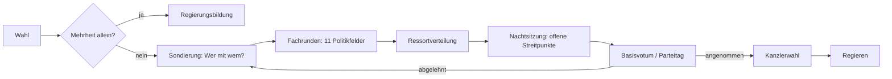

# 5 · Wahlkampf- und Koalitionsmechanik mit Formeln und Werten

> **Implementierungsstand:** Die Kommunal-Variante (Kapitel 5.1–5.3, 5.8) läuft im Prototyp (`prototype/src/js/20-engine-election.js`). Landes-/Bundes-Varianten, Plakat-/Spot-Editor, Duell-Minispiel und Koalitionsverhandlung sind als Formelwerk spezifiziert und für den Vertical Slice vorgesehen. Alle Zahlen sind **Startwerte für das Balancing** (Kapitel 10).

---

## 5.1 Wähler-Modell: Milieus × Multinomial-Logit

Die Wählerschaft wird in **Milieus** *g* (Zielgruppen nach Alter, Region, Lebenslage) eingeteilt. Jedes Milieu wählt nach einem *Multinomial-Logit* (MNL): Es bewertet jede Kandidatur *c* mit einem Nutzen *U* und wählt mit Wahrscheinlichkeit proportional zu `exp(U)`.

```
U(c, g) =  A · pw_c · aff(Partei_c, g)            // Parteiaffinität des Milieus
         + P · Σ_t sal(g, t) · (komp(c, t) − 0,45)  // Themenprofil × Themen-Salienz
         + C · pers_c                              // Persönlichkeit (Beliebtheit, Charisma, Medienecho, Stress)
         + I · amtsbonus_c                         // Amtsinhaber-Bonus
         + R · (bekanntheit_c − 0,5)               // Bekanntheit
         + boost(c, g)                             // Kampagnenkanäle + Slogan + Ereignis-Wirkungen je Milieu
         + offset_c                                // Kalibrierung (Schwierigkeit, nur Spieler:in)

P(c | g) = exp(U(c, g)) / Σ_c' exp(U(c', g))
```

**Parameter im Prototyp** (Kommune; kalibriert in Kapitel 10):

| Parameter | Wert | Bedeutung |
|---|--:|---|
| `A` | 0,8 | Gewicht der Parteiaffinität (auf Kommunalebene moderat: Person > Partei) |
| `P` | 3,0 | Gewicht des Themenprofils |
| `C` | 1,9 | Gewicht der Persönlichkeit |
| `I` | 0,35 | Amtsinhaber-Bonus |
| `R` | 0,9 | Gewicht der Bekanntheit |
| `B` | 0,42 | Gewicht der Beliebtheit innerhalb von `pers` |
| `pw` | 0,7 + 0,6·Parteiloyalität/100 | Parteiloyalität skaliert die Parteiaffinität (BSW: fix 0,75) |
| `pers` | `clamp((Bel−38)/40; −0,8; 1,3)·B + (Charisma−45)/160 + clamp(Med; ±60)/400 − max(0; Stress−70)/300` | Persönlichkeitswert des Spielers |
| Stichwahl-Abzug | −0,45 für AfD-Kandidaturen | Kooperationssperre (Kapitel 3) |

**Milieus im Prototyp** (Anteil an der Wählerschaft · Themen-Salienz: Wirtschaft / Wohnen / Verkehr / Klima / Sicherheit / Soziales):

| Milieu | Anteil | Wirt | Wohn | Verk | Klima | Sich | Soz | Wahlbeteiligung |
|---|--:|--:|--:|--:|--:|--:|--:|--:|
| Innenstadt & Studis | 14 % | 0,10 | 0,30 | 0,20 | 0,25 | 0,05 | 0,10 | 42 % |
| Familien im Neubaugebiet | 20 % | 0,15 | 0,20 | 0,15 | 0,10 | 0,10 | 0,30 | 55 % |
| Senior:innen | 24 % | 0,10 | 0,10 | 0,10 | 0,05 | 0,30 | 0,35 | 68 % |
| Gewerbe & Mittelstand | 12 % | 0,40 | 0,10 | 0,20 | 0,05 | 0,15 | 0,10 | 55 % |
| Dörfliche Ortsteile | 18 % | 0,15 | 0,10 | 0,25 | 0,10 | 0,20 | 0,20 | 62 % |
| Schichtarbeit & Pflege | 12 % | 0,20 | 0,25 | 0,10 | 0,05 | 0,10 | 0,30 | 45 % |

**Stimmbezirke.** 24 Bezirke mischen die Milieus (dominantes Milieu ×4,2, Rest ×0,55, ±Zufall) und besitzen ein *Bezirks-Rauschen* `exp(N(0; 0,22))` je Kandidatur. Das Rauschen wird **einmal** gezogen – Umfragen und Wahlabend beruhen auf derselben „Wahrheit“.

### Wahl-Ebenen im Vergleich

| Ebene | Stimmen | Modell | Besonderheit |
|---|---|---|---|
| Kommune (OB/Bürgermeister:in) | 1 (Direktwahl) | MNL pro Milieu, Stichwahl bei < 50 % | Stichwahl mit 14 Tagen Abstand, Beteiligung × 0,86, Top 2 |
| Kommune (Gemeinderat) | Listen/Personen | MNL mit Kumulieren/Panaschieren (vereinfacht) | Sainte-Laguë auf Listen |
| Land / Bund | Erststimme + Zweitstimme | siehe 5.2 | Sperrklausel + Grundmandate |
| EU | 1 Liste | Zweitstimmen-Modell | keine Direktmandate |

## 5.2 Landes-/Bundesmodell (Erst- und Zweitstimme)

```
Zweitstimme:   U2(p, g) = a·aff(p,g) + b·Σ_t sal(g,t)·(komp(p,t)−k̄) + c·Kanzlerbonus_p + d·Zeitgeist_p(t)
                          − e·Regierungsmalus_p + f·Kampagne(p,g) + h·Kompetenz_Aktualität(p)
Erststimme:    U1(k, g) = U2(Partei_k, g) + j·pers_k + m·Bekanntheit_k − n·Lager_Abzug + Splitting(k,g)
Splitting:     Wähler:innen von Partnerparteien leihen Stimmen (Leihstimmen), z. B. FDP-Wähler:innen geben der CDU die Erststimme
```

| Parameter | Start (Bund) | Spanne (Balancing) |
|---|--:|---|
| a | 1,2 | 0,8–1,6 |
| b | 2,5 | 1,5–3,5 |
| c (Kanzlerbonus) | 1,0 | 0,5–1,5 |
| d (Zeitgeist) | 1,0 | 0,7–1,3 |
| e (Regierungsmalus) | 0,012 pp/Woche, max. 14 % rel. | 0,008–0,02 |
| Leihstimmen | 1,0–2,5 pp | je nach Koalitionsoption |

## 5.3 Kampagnen-Kanäle und Budget

### Formel

```
spend_c                     : Ausgabe in Kanal c (k€ in der Kommune; Mio. € Land; Mio. € Bund, skaliert)
eff_c  = ln(1 + spend_c / S)                          // abnehmender Grenznutzen; S = Skalierung je Ebene
boost_g = 0,32 · tanh( Σ_c eff_c · w(c, g) / 2,4 )     // Milieu-Bonus, begrenzt auf max. +0,32
Linke:  eff_Straße × 1,5
```

| Ebene | Skalierung `S` | Typischer Etat (Startwerte) |
|---|--:|---|
| Kommune | 4 k€ | 2–34 k€ (je Partei) |
| Land | 0,4 Mio. € | 0,5–8 Mio. € |
| Bund | 4 Mio. € | 1–28 Mio. € |

### Wirkungsmatrix Kanal × Milieu `w(c, g)` (Prototyp)

| Kanal | Jung | Familien | Senioren | Gewerbe | Dorf | Schicht |
|---|--:|--:|--:|--:|--:|--:|
| 🪧 Plakate | 0,4 | 0,5 | 0,6 | 0,4 | 0,7 | 0,6 |
| 📱 Social Media | 1,0 | 0,6 | 0,1 | 0,3 | 0,2 | 0,5 |
| 🚪 Straße & Haustür | 0,5 | 0,6 | 0,7 | 0,4 | 0,6 | 0,8 |
| 📻 Radio & Lokalpresse | 0,1 | 0,3 | 1,0 | 0,6 | 0,8 | 0,5 |
| 🎪 Events & Bierzelt | 0,5 | 0,7 | 0,5 | 0,8 | 1,0 | 0,4 |

*Vollausbau (Land/Bund) ergänzt:* **TV-Spots** (Senioren 1,0 · Familien 0,5 · Gewerbe 0,6 · Schicht 0,6), **Podcasts** (Jung 0,8 · Gewerbe 0,5), **Online-Anzeigen** (Jung 0,9).

### Slogan-Bewertung nach Zielgruppe

Jeder Slogan trägt einen **Milieu-Vektor** (`jung, fam, sen, gew, dorf, arb`, Werte ±0,1):

| Slogan | Jung | Fam | Sen | Gew | Dorf | Schicht |
|---|--:|--:|--:|--:|--:|--:|
| „Niederhüttingen: Mach was draus.“ | +0,10 | +0,05 | −0,04 | +0,05 | −0,02 | +0,02 |
| „Sicher. Sauber. Ehrlich.“ | −0,04 | +0,05 | +0,10 | +0,04 | +0,05 | +0,02 |
| „Gutes Leben für alle Ortsteile.“ | +0,02 | +0,06 | +0,04 | 0,00 | +0,10 | +0,04 |
| „Bezahlbar wohnen. Bequem ankommen.“ | +0,08 | +0,10 | +0,02 | 0,00 | +0,02 | +0,08 |
| „Anpacken statt aussitzen.“ | +0,03 | +0,04 | +0,03 | +0,09 | +0,04 | +0,06 |

**Eigene Slogans** werden per **Schlüsselwort-Lexikon** (Themen, Ton, Länge) bewertet: `Wirkung = Σ Treffer_Thema · Milieu-Salienz + Ton-Bonus − Länge-Abzug(> 6 Wörter) − Cringe-Risiko`. Im Prototyp erhält ein freier Slogan einen seed-basierten Zufallsvektor (−0,05…+0,09) als Platzhalter.

### Plakat-Editor (Vertical Slice)

```
Lesbarkeit   L = clamp(Kontrast / 7; 0; 1) · (1 − 0,03 · max(0; Wörter − 7))
Sympathie    S = Lächeln(0,4…1,0) · Stil-Passung
Zielgruppen-Fit F_g = 1 − |Ton − Ton_g|                    // Ton: 0 sachlich … 1 frech
Wirkung      W_g = Reichweite · (0,5·L + 0,3·S + 0,2·F_g)
Cringe       X = clamp(0,05 + 0,30 · Humoranteil · (1 − Medienwirkung/100) + 0,25 · Milieu-Mismatch; 0; 0,7)
Shitstorm    p = X · (1 + Medienecho/200); Folge: Med −3…−8, Bel −1…−4; Streisand-Effekt: Reichweite ×2
```

### Spot-Baukasten, Social-Posts, Memes

| Baustein | Optionen | Kosten | Wirkung / Risiko |
|---|---|---|---|
| Spot (15/30/60 s) | Ton (sachlich, emotional, humorvoll, Angriff), Sprecher:in, Musik | ∝ Länge × Reichweite | TV-Reichweite × Ton-Fit; Angriff: Backlash-Risiko (5.6) |
| Social-Post | Text, Bild, Hashtag | sehr gering | Reichweite ~ Follower × Engagement; Virales Risiko `p_viral = 0,05 + 0,4·Humor·Medienwirkung/100` |
| Meme | Vorlage, Text | gering | hohes Jung-Plus, hohes Cringe-Risiko bei Senior-Zielgruppe |

## 5.4 Wahlziele und Erfolgsbewertung

| Wahlziel | Schwelle | Erfolg | Risiko / Bonus |
|---|---|---|---|
| Direktmandat | Wahlkreis gewonnen | +150 XP | Hochrisiko bei Schwächung in Stichwahl |
| 5-%-Hürde | ≥ 5,0 % *oder* 3 Direktmandate | +120 XP | Kleine Parteien: Volatilität ×1,3 |
| Zweistellig | ≥ 10 % | +200 XP | – |
| Stärkste Kraft | Platz 1 | +300 XP | Erwartungsdruck: Verlust bei Verfehlen −10 Par |
| Regierungsbeteiligung | Teil einer Mehrheitskoalition | +400 XP | – |
| Absolute Mehrheit | > 50 % der Sitze | +800 XP | extrem selten, nur Kommune/Land |

Das *gewählte* Ziel beeinflusst Erwartungen: Wer „stärkste Kraft“ ansagt und Zweiter wird, bekommt **Enttäuschungs-Malus** (`Par −(Ziel − Ergebnis)·2`); wer tiefstapelt und gewinnt, erhält **Überraschungs-Bonus** (Med +8, Momentum +2).

## 5.5 Themenschwerpunkte

Elf Wahlkampfthemen: *Wirtschaft, Migration, Klima, Rente, Bildung, Sicherheit, Wohnen, Digitalisierung, Gesundheit, Verkehr, Außenpolitik*. Jedes Thema hat:

- **Salienz** `sal(g, t)` je Milieu (Wichtigkeit),
- **Kompetenz** `komp(Partei, t)` (Zuschreibung, 0–1), die durch Entscheidungen *wandert*: `komp += Δ` (Prototyp: +0,04 … +0,12 je Option),
- **Agenda-Setting:** Wer über ein Thema spricht, erhöht dessen Salienz kurzfristig (`sal(t) += 0,03·Medienreichweite`), wovon die Partei profitiert, die dort kompetent ist.

## 5.6 Dialog-Minispiele und Negative Campaigning

### Bürgergespräch (Haustür / Bierzelt)
Pro Gespräch: Bürger:in mit **Milieu**, **Thema**, **Stimmung** (−2…+2); Spieler:in wählt 1 von 3 Antworten (*Zuhören – Erklären – Versprechen*).
`Δ Zustimmung = 0,6·Match(Thema, Antwort) + 0,3·Empathie(Charisma) + 0,1·Fakten(Intelligenz) − 0,15·Stress/100`. Versprechen erhöhen sofort, belasten aber später (Versprechens-Register).

### TV-Duell / Triell / Talkshow (Minispiel)
Vier Teilwerte pro Runde: **Schlagfertigkeit** (Timing-Probe), **Faktenwissen** (Quiz mit Hinweisen), **Körpersprache** (Haltung, Blickführung), **Nerven** (Stress-Kurve).

```
Score      = 0,30·Schlagfertig + 0,30·Fakten + 0,20·Körper + 0,20·Nerven        (0…100)
Δ Zustimmung (pp) = (Score − 50)/50 · 2,5 · Reichweite_TV · (1 + 0,5·Patzer_Kritisch)
Patzer     : p = 0,04 + 0,002·max(0; Stress − 50); Folge: Med −6, viraler Clip (Streisand ×2)
```

### Negative Campaigning und Kontrastwerbung
```
Schaden_Gegner  D = Reichweite · Glaubwürdigkeit_Vorwurf · Empfindlichkeit_Gegner
Backlash        B = σ( (Schärfe − 0,5) · 3 + (1 − Integrität/100) · 1,5 − Wahrheitsgehalt · 2 )
Gewinn          = 0,5 · D · (1 − B) − Backlash_Malus (Bel −3…−8, Med −4…−10, Mobilisierung Gegner +2 %)
```
Skandalenthüllungen sind **Hochrisiko-Optionen**: Wenn die Quelle angreifbar ist oder der Vorwurf zerfällt, wird die Enthüllung zum *Bumerang-Ereignis* (Kettenbeginn, Kapitel 7).

## 5.7 Wahlsystem (vereinfacht, nachvollziehbar)

Bundestag: **630 Sitze**, Erst- und Zweitstimme, 299 Wahlkreise, **5-%-Hürde**, **Grundmandatsklausel** (3 Direktmandate), **Sainte-Laguë/Schepers**.

- **Modus „Reform“ (Standard):** feste Größe, **Zweitstimmendeckung** – Direktmandate über der Zweitstimmen-Sitzzahl entfallen (schwächste zuerst).
- **Modus „Klassik“ (Schalter):** Überhang- und Ausgleichsmandate, das Parlament wächst (Szenario-Spaß).

### Rechenbeispiel (aus `tools/examples.js`)

| Partei | Zweitstimmen | Direktmandate | Hürde | Sitze (630) |
|---|--:|--:|---|--:|
| CDU | 24,0 % | 88 | ≥ 5 % | 198 |
| SPD | 17,0 % | 40 | ≥ 5 % | 140 |
| AfD | 19,0 % | 75 | ≥ 5 % | 157 |
| Grüne | 12,0 % | 14 | ≥ 5 % | 99 |
| FDP | 4,6 % | 0 | scheitert (4,6 %, 0 Direktmandate) | 0 |
| Linke | 4,4 % | 3 | Grundmandatsklausel | 36 |
| BSW | 4,2 % | 0 | scheitert | 0 |

Berücksichtigte Stimmen: 76,4 % → Divisor ≈ 0,1213 pp je Sitz. Mehrheit ab 316 Sitzen. **Wichtig:** 23,6 % der Stimmen (FDP 4,6 · BSW 4,2 · Sonstige 14,8) fallen unter den Tisch – deshalb erhalten CDU + SPD + Grüne mit „nur“ 53 % der Stimmen 437 von 630 Sitzen (69 %).

**Klassik-Beispiel (Mini-Landtag, 100 Sitze, 50 Wahlkreise):**

| Partei | Zweitstimmen | Sitze nach Zweitstimmen | Direktmandate | Überhang | Sitze mit Ausgleich |
|---|--:|--:|--:|--:|--:|
| A | 37 % | 37 | 41 | 4 | 41 |
| B | 27 % | 27 | 6 | 0 | 30 |
| C | 19 % | 19 | 3 | 0 | 21 |
| D | 11 % | 11 | 0 | 0 | 12 |
| E | 6 % | 6 | 0 | 0 | 7 |

Das Parlament wächst von 100 auf **111** Sitze (+11). Im Bundestag-Maßstab führt das bei knappen Erststimmen-Vorsprüngen schnell zu dreistelligen Zuwächsen.

## 5.8 Wahlabend (implementiert)

| Zeit | Phase | Berechnung |
|---|---|---|
| 18:00 | **Prognose** (Nachwahlbefragung) | `Anteil_c + N(0; 2,0 pp)`, normalisiert |
| 18:45 | 1. Hochrechnung | 22 % der Bezirke ausgezählt |
| 19:30 | 2. Hochrechnung | 46 % |
| 20:15 | 3. Hochrechnung | 71 % |
| 21:00 | 4. Hochrechnung | 92 % |
| 22:30 | **Endergebnis** | 100 % |

**Auszählungsreihenfolge:** Bezirke werden nach `Größe × U(0,65; 1,35)` aufsteigend ausgezählt – **kleine Dörfer zuerst, Innenstadt zuletzt** (realistische Verzerrung früher Zwischenstände).
**Hochrechnung:** `H = w·Zwischenstand + (1−w)·Prognose`, mit `w = f^0,75` (*f* = Auszählungsanteil). So korrigiert sich die Hochrechnung glatt auf das Endergebnis.
**Elefantenrunde** (Cutscene, Kapitel 12) reagiert auf Ergebnis, Abstand und Figurenbeziehungen.

---

## 5.9 Koalitionsmechanik

### Ablauf



### 1 · Sondierung: Machtindex und Kompatibilität

Nur **minimale Gewinnkoalitionen** (jede Partei ist nötig) sind realistisch; Unvereinbarkeiten (z. B. Kooperationssperre) blockieren Kombinationen. **Verhandlungsmacht** ist der **Shapley-Shubik-Index** (Mehrheitsrelevanz), nicht der Sitzanteil:

| Koalition | Sitze | Sitzanteile | Shapley-Shubik (Verhandlungsmacht) |
|---|--:|---|---|
| Union + SPD + Grüne | 437 | Union 45 % · SPD 32 % · Grüne 23 % | Union 50 % · SPD 50 % · Grüne 0 % |
| Union + Grüne + FDP | 337 | Union 59 % · Grüne 29 % · FDP 12 % | **je 33 %** |
| Union + SPD + FDP | 378 | Union 52 % · SPD 37 % · FDP 11 % | Union 50 % · SPD 50 % · FDP 0 % |
| SPD + Grüne + Linke (knapp) | 319 | SPD 44 % · Grüne 31 % · Linke 25 % | **je 33 %** |

**Lesart:** Sind alle Partner nötig, hat jeder gleiche Macht – auch die kleine FDP. Reichen zwei Partner, ist der dritte *überzählig* (0 %) und kann nur durch Drohungen (Bündniswechsel) Gewicht gewinnen. Das Spiel gibt diese Einsicht als „Spielregel-Hinweis“ aus.

**Verhandlungsmacht im Spiel:** `V_i = Shapley_i · (1 + 0,25·Drohpotenzial_i) · (1 + 0,2·Alternativen_i)` mit `Drohpotenzial` (z. B. CSU: Fraktionsgemeinschaft aufkündigen) und `Alternativen` (BATNA: Zahl machbarer anderer Koalitionen).

### 2 · Fachrunden und Kompromissliste

Elf Politikfelder. Jede Partei hat pro Feld eine **Position** `x ∈ [−100; 100]`, eine **Wichtigkeit** `w ∈ [0; 1]` und optional eine **rote Linie** `ρ` (Toleranz).

```
Einigungsposition  x* = Σ_i V_i · x_i / Σ_i V_i                (Machtgewichteter Schwerpunkt)
Verletzung rote Linie:   |x* − x_i| > ρ_i   →   Konflikt (ungelöst)
Erfüllungsgrad     E_i,f = 1 − |x* − x_i,f| / 200
Zufriedenheit      Z_i   = Σ_f w_i,f · E_i,f / Σ_f w_i,f
Abbruch            wenn Z_i < 0,45  oder  rote Linie ungelöst bis zur Nachtsitzung
```

**Kompromisslisten:** Der Spieler tauscht *Felder gegen Felder*: Ein Feld mit Wichtigkeit `w_hoch` kann gegen zwei Felder mit `w_niedrig` eingetauscht werden (Kompensation). Kann das Verhandlungsziel nicht erreicht werden, bleibt der Streitpunkt für die **Nachtsitzung**.

### 3 · Ministerienverteilung

Ressortwerte (Summe 86): Finanzen 10 · Außen 9 · Inneres 8 · Wirtschaft 8 · Arbeit & Soziales 8 · Verteidigung 6 · Gesundheit 6 · Verkehr 5 · Umwelt 5 · Bildung 5 · Justiz 5 · Bauen 4 · Digitales 4 · Landwirtschaft 3.
Soll-Punkte je Partner `= Sitzanteil · (86 + 8)`; die Kanzlerpartei erhält **8 Richtlinien-Punkte** für das Kanzleramt vorab. Die Wahl erfolgt abwechselnd nach **Sainte-Laguë-Rang** (größter Rückstand zuerst).

| Partner | Sitzanteil | Soll-Punkte (86 + 8) | Ist-Punkte | Ministerien |
|---|--:|--:|--:|---|
| CDU | 45 % | 42,6 | 40 | Finanzen, Inneres, Verteidigung, Landwirtschaft, Justiz |
| SPD | 32 % | 30,1 | 32 | Arbeit & Soziales, Außen, Bauen, Gesundheit, Bildung |
| Grüne | 23 % | 21,3 | 22 | Umwelt, Wirtschaft, Verkehr, Digitales |

Die Abweichung `Ist − Soll` (hier CDU −2,6, SPD +1,9, Grüne +0,7) fließt als **Unzufriedenheit** in die Koalitionsstabilität ein.

### 4 · Nachtsitzung

Jede **Nachtsitzung** erhöht die Kompromissbereitschaft (`Toleranz ρ × 1,15`), kostet aber **Stress +6**, **Medienecho** (Erschöpfungs-Bilder) und birgt *Ausrutscher*: `p_Ausrutscher = 0,05 + 0,004·(Stress − 40)` (Folge: Durchstecher-Ereignis). Bis zu **drei** Nächte; danach Abbruch oder Vertragsannahme mit der aktuellen Liste.

### 5 · Basisvotum / Parteitag

`P(Annahme) = σ( (Z̄_Partei − 0,55) · 10 + 0,03·(Par − 50) )`. Ein gescheitertes Votum schickt zurück in die Sondierung (Koalitionsvertrag nachverhandeln) oder zu Neuwahlen.

### 6 · Regieren: Stabilität, Krisen, Vertrauensfrage

```
Stabilität_{t+1} = Stabilität_t + 0,2 · (Z̄ − Stabilität_t) − Streit_Event − 0,5·Flügelstreit_Partner + Erfolge(Gesetz)·0,5
Bruch pro Woche  p = σ( (40 − Stabilität) / 7 )                   // unter ~35 wird es gefährlich
```

| Instrument | Wer | Wirkung |
|---|---|---|
| **Vertrauensfrage** | Kanzler:in | Bei Niederlage: Neuwahl-Option; bei Sieg Disziplin-Schub (+6 Stabilität, −4 Par) |
| **Konstruktives Misstrauensvotum** | Opposition | Erfolg nur mit Mehrheit für *neue:n* Kanzler:in (316) |
| **Kabinettsumbildung** | Kanzler:in | Löst Streitfälle; Kosten: Stabilität −3, NPC-Beziehungen ± |
| **Rücktritt** | Minister:in/Kanzler:in | Skandal-Folge; Nachfolge-Verfahren |
| **Neuwahl** | Bundespräsident:in/Bundestag | Wahlkampf mit Schuldzuweisungs-Modifikator (+3 / −3 pp) |
