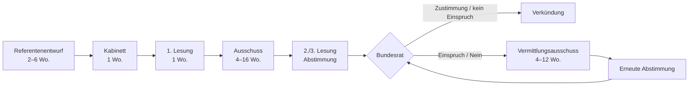

# 6 · Bundestags- und Umfragesystem mit Formeln und Werten

> **Implementierungsstand:** Plenarsaal-Grafik, Redner-Minispiel (Kap. 6.3), Sitzverteilung/Koalitionsoptionen, Sonntagsfrage (Rathaus + Bund), Institute mit Hauseffekten, Trendkurven und „Warum?“-Erklärungen laufen im Prototyp. Gesetzgebungs-Pipeline, Abstimmungsmodell, Untersuchungsausschüsse und Wählerwanderungs-Sankey sind spezifiziert (Vertical Slice).

---

# A · Bundestag

## 6.1 Parlamentsalltag als Spielstruktur

| Element | Mechanik | Spielwert |
|---|---|---|
| **Sitzungswoche** | 22 Sitzungswochen/Jahr → im Spiel ein „Plenarblock“ aus 3–4 Karten | pro Sitzungswoche: Fraktionssitzung (Di), Regierungsbefragung/Fragestunde (Mi), Aktuelle Stunde, Debatten (Mi–Fr) |
| **Tagesordnung** | Punkte mit Redezeit-Kontingenten nach Fraktionsstärke | Redezeit der Fraktion `= Gesamtzeit · Sitzanteil` (Stunde: 60–180 min) |
| **Haushaltswoche** | 1× jährlich; Einzelpläne, Bereinigungssitzung (Nachtsitzung) | Kasse-Wert skaliert in Mrd.; Streichlisten, Kompromisse |
| **Redezeit** | Minispiel: 8 Min. (Standard), überziehen kostet | siehe 6.3 |
| **Fraktionsdisziplin** | Abweichler-Modell | siehe 6.4 |
| **Namentliche Abstimmung / Hammelsprung** | Sichtbar machen oder Mehrheit zählen | Hammelsprung: „Zählung“ ohne Kameras (Abweichler bleiben unsichtbar), Kosten: Zeit + Medienecho −2 |
| **Ausschüsse** | Fachausschuss mit Anhörungen | Vorsitz/Berichterstatter:in = Hebel für Änderungsanträge |
| **Opposition** | Anträge, Kleine/Große Anfragen, Untersuchungsausschuss, Misstrauensvotum | siehe 6.5 |
| **Lobbyisten** | NPCs mit Zielen, Geheimnissen, Gefälligkeiten | Hinterzimmer-Deals (+Par, −Med), Enthüllungsrisiko 25–35 % |

## 6.2 Gesetzgebungsprozess (Pipeline)



| Phase | Dauer (Wochen) | Wer entscheidet | Mechanik | Erfolgswahrscheinlichkeit / Kosten |
|---|--:|---|---|---|
| **Referentenentwurf** | 2–6 | Ministerium | Qualität `Q = 0,4·Intelligenz + 0,3·Beraterqualität + 0,3·Ressortstärke` | `P(Fehler im Entwurf) = 0,25 − 0,002·Q` → Nachbesserungs-Event |
| **Kabinett** | 1 | Regierung | Koalitionsstabilität, Ressortabstimmung | Abbruch-Risiko `= 0,25·(1 − Stabilität/100)` |
| **1. Lesung** | 1 | Plenum | Zuweisung an Ausschuss, Redemarathon | Medien: Debattenqualität beeinflusst Erstbild |
| **Ausschuss** | 4–16 | Ausschussmehrheit | Anhörung, Änderungsanträge, Lobby-Einfluss `L` | Dauer `= 4 + 12·Streitgrad`; Lobby: `Änderungsdruck = Σ Lobbyist_i·Einfluss_i` |
| **2./3. Lesung** | 1 | Plenum (Ja > Nein) | Abstimmungsmodell (6.4) | `P(Annahme)` aus Normalnäherung |
| **Bundesrat** | 3–6 | Länder (69 Stimmen, 35 nötig) | *Einspruchsgesetz* (≈ 60 %) vs. *Zustimmungsgesetz* (≈ 40 %) | Länderkoalitionen bestimmen Stimmen (Enthaltung = Nein) |
| **Vermittlungsausschuss** | 4–12 | 32 Mitglieder (16 BT / 16 BR) | Kompromiss zu Streitpunkten | Erfolgschance `σ(0,08·(Verhandlungsgeschick − 50) + 0,4)` |
| **Verkündung** | 1 | Bundespräsident:in | Prüfung (selten Stopp) | `P(Stopp) = 0,02 + 0,1·Verfassungsrisiko` |

**Gesetzentwürfe schreiben.** Der Spieler wählt *Ziel*, *Stellschrauben* (z. B. Höhe, Frist, Ausnahmen) und *Begründung*. Jede Stellschraube verändert **Wirkung** (auf Wirtschaft/Umwelt/Gesellschaft), **Kosten**, **Streitgrad** und **Zustimmungspflicht**. Vorschau-Qualität hängt von Berater:innen (Kap. 2.5).

## 6.3 Redner-Minispiel (implementiert)

**Ablauf:** Thema (3) → Tonfall (3) → vier Redeabschnitte (*Einstieg, Analyse, Lösung, Schluss*) mit je drei Argumenten → nach jedem Abschnitt ein **Zwischenruf** mit Reaktionswahl (4,7 s Zeitdruck) → Wertung.

### Argumente und Fraktionsreaktion

Jedes Argument hat einen **Typ** (`fakt`, `emo`, `vision`, `humor`, `angriff`) und eine **Position** `pos = [Ökonomie, Kultur]` (−1 umverteilend/progressiv … +1 marktliberal/konservativ). Fraktionen haben eigene Positionen `fpos`:

| Fraktion | Ökonomie | Kultur |
|---|--:|--:|
| Linke | −0,90 | −0,70 |
| SPD | −0,50 | −0,30 |
| Grüne | −0,30 | −0,85 |
| BSW | −0,40 | +0,50 |
| FDP | +0,85 | −0,20 |
| Union | +0,50 | +0,50 |
| AfD | +0,35 | +0,90 |

```
d      = ‖pos_Argument − pos_Fraktion‖                   (euklidisch)
r      = 1 − d / 1,4                                     (Nähe → −1 … +1)
r     += 0,35        wenn Fraktion = eigene Fraktion
humor:   r = 0,5·r + 0,35
angriff: Zielfraktion r = −0,9; ideologisch nahe Fraktionen (dist < 1) r = min(r; −0,25); eigene Fraktion r = +0,7; übrige r = 0,4·r + 0,1
Tonfaktor m(Typ, Ton)   r ← r·m wenn r > 0, sonst r / max(0,6; m);  + N(0; 0,08)
Beifall_f  += r                                         (begrenzt auf −3 … +3)
```

| Tonfall | Fakt | Vision | Emotion | Humor | Angriff | Hinweis |
|---|--:|--:|--:|--:|--:|---|
| **Sachlich** | 1,30 | 1,00 | 0,85 | 0,90 | 0,75 | wenig Risiko |
| **Angriffslustig** | 0,90 | 0,90 | 0,85 | 1,00 | 1,45 | Ordnungsruf-Risiko |
| **Emotional** | 0,80 | 1,30 | 1,35 | 1,00 | 0,90 | Zahlen wirken blass |

**Redezeit:** Budget 8 Minuten; Kosten je Abschnitt: Fakten 1,4 · Emotion 1,6 · Vision 1,7 · Humor 1,0 · Angriff 1,2; Zwischenfrage +1,0; Überziehen `−6` Punkte je Minute.

**Ordnungsruf:** bei *Angriff*-Argumenten `p = 0,38` (Ton „angriffslustig“) bzw. `0,12` (sonst); Folge: Beifall eigene Fraktion −0,4, Ordnungsruf-Zähler +1 (−9 Punkte in der Wertung).

### Zwischenrufe

Die Fraktion mit der **niedrigsten Stimmung** (nie die eigene) ruft dazwischen. Reaktionen:

| Reaktion | Erfolgschance | Erfolg | Misserfolg |
|---|---|---|---|
| **Schlagfertig kontern** | `clamp(0,5 + ((Charisma + Medienwirkung)/2 − 52 − StressMalus)/80; 0,12; 0,9)` | Beifall eigene +0,5, Zwischenrufer +0,2 | eigene −0,2, Zwischenrufer −0,3; 30 % Ordnungsruf |
| **Zwischenfrage zulassen** (+1 Min.) | `clamp(0,5 + (Intelligenz − 50 − StressMalus)/80; 0,12; 0,9)` | alle +0,25 | alle −0,2, Zwischenrufer +0,3 |
| **Ignorieren** | sicher | Zwischenrufer −0,1 | (Timeout: −0,2) |

`StressMalus = 0,4 · max(0; Stress − 60)`.

### Wertung

```
Ø Beifall    = Σ Sitze_f · Beifall_f / ΣSitze / 3        (−1 … +1)
eigene Fraktion = Beifall_eigen / 3
Score = 50 + 34·Ø + 16·eigen − 9·Ordnungsrufe − 6·Überziehung      (0 … 100, geklemmt)
Medienecho += 2·round((Score − 50)/8)       Fraktionsrückhalt += round(4·eigen − 2·Ordnungsrufe)
```

| Score | Bewertung |
|---|---|
| ≥ 80 | **Rede des Tages** |
| 60–79 | **Starker Auftritt** |
| 40–59 | **Solide** |
| < 40 | **Verpufft** |

### Plenarsaal-Grafik

630 Punkte in neun konzentrischen Halbkreisen (Radius 62–178 px); Sitze je Reihe ∝ Radius; Reihenfolge von links nach rechts *Linke · SPD · Grüne · (Eigene) · FDP · BSW · Union · AfD*. Reagierende Fraktionen pulsieren, die restlichen sind abgedunkelt.

## 6.4 Abstimmungsmodell und Fraktionsdisziplin

Jede Fraktion *f* hat `Disziplin D_f ∈ [0; 1]` (Fraktionsführung × Stimmung), jedes Gesetz `Gewissenskonflikt G` und `Wahlkreisbetroffenheit W` (je 0–1):

```
p_Abweichung(f) = clamp( 0,02 + 0,25·G + 0,15·W − 0,30·(D_f − 0,5) ; 0,01 ; 0,6 )
μ(Ja − Nein)    = Σ_f Sitze_f·(1 − 2·p_f)·Richtung_f                 (Richtung = +1 pro Regierung, −1 pro Opposition)
σ²              = Σ_f Sitze_f · 4·p_f·(1 − p_f)
P(Annahme)      = Φ( μ / σ )                                          (Normalnäherung; Kanzlermehrheit: 316 Ja)
```

**Beispiel** (Koalition 437 Sitze, Opposition 193 Sitze):

| Gesetz | G | W | D | p_Abw. | Abweichler | Ja | Nein | Ja−Nein | σ | P(Annahme) |
|---|--:|--:|--:|--:|--:|--:|--:|--:|--:|--:|
| Routinegesetz | 0,1 | 0,1 | 0,8 | 0,01 | 4 | 433 | 197 | +235 | 4 | **~100 %** |
| Streitgesetz, Fraktion diszipliniert | 0,5 | 0,4 | 0,6 | 0,175 | 76 | 361 | 269 | +91 | 16 | **~100 %** |
| Streitgesetz, Fraktion zerstritten | 0,5 | 0,4 | 0,3 | 0,265 | 116 | 321 | 309 | +12 | 18 | **75 %** |

**Hebel des Spielers:** *Machtwort* (D +0,15, Par −3), *Gewissensfreiheit* (G-Abzug −0,3, Par +2, dafür Disziplin-Malus später), *Wahlkreis-Goodies* (W −0,2, Kasse −), *Hinterzimmer-Deal* (D +0,1, Med −2, Enthüllungsrisiko 30 %).

## 6.5 Oppositionsinstrumente

| Instrument | Voraussetzung | Wirkung im Spiel |
|---|---|---|
| **Antrag / Entschließungsantrag** | Fraktion | Themensetzung: `sal(Thema) += 0,05`, Medien-Fenster 1 Woche |
| **Kleine Anfrage** | 5 % der Abgeordneten | Regierung muss antworten → Info-Gewinn, Enthüllungs-Chance |
| **Große Anfrage** | Fraktion | Plenardebatte, Regierungsbilanz |
| **Untersuchungsausschuss** | 25 % der Mitglieder | Kettenereignis (Kap. 7), Dauer 12–40 Wochen, Skandal-Verstärkung |
| **Konstruktives Misstrauensvotum** | Mehrheit für neue:n Kanzler:in | Regierungswechsel bei 316 Stimmen |
| **Aktuelle Stunde** | Fraktion | Kurzdebatte, Reaktionsdruck für Regierung |

---

# B · Umfragen

## 6.6 Latentes Zeitreihen-Modell

**„Wahrheit“** (latente Stimmung) `S_p(t)` für jede Partei *p* (in %), Wochenschritte:

```
S_p(t+1) = S_p(t) + k · ( T_p(t) − S_p(t) ) + ε_p            k = 0,15   (Trägheit: Umfragen reagieren verzögert)
T_p(t)   = B_p + Z_p(t) + E_p(t) − G_p(t) + SpielerEffekt_p(t)
Z_p(t)   = 0,95·Z_p(t−1) + σ_Z,p · √(B_p/15) · N(0;1)       (AR(1)-Zeitgeist), Nullsummen-normalisiert
E_p(t)   = Σ_Ereignisse Schock · 0,94^Alter                  (Skandale, Erfolge; Abklingen ~6 %/Woche)
G_p(t)   = B_p · min(0,14; 0,0007·t)   (Regierungsparteien: Legislatur-Verlust, bis −14 % relativ)
Normierung: Σ_p T_p = 100
```

| Parameter | Wert | Hinweis |
|---|--:|---|
| `k` (Trägheit) | 0,15 / Woche | ≈ 4,3 Wochen Halbwertszeit |
| `σ_Z` je Partei | CDU 0,30 · CSU 0,12 · SPD 0,30 · AfD 0,34 · Grüne 0,28 · FDP 0,22 · Linke 0,22 · BSW 0,26 · Sonstige 0,18 | wöchentlicher Zeitgeist-Schock (pp) |
| Schock-Wahrscheinlichkeit | 5 %/Woche, 55 % negativ, Stärke 1,2–3,8 pp × √(B/15) | Skandal-Multiplikator AfD 1,4 · BSW 1,2 · FDP 1,1 |
| Regierungsmalus | bis −14 % relativ nach 200 Wochen | im Prototyp vereinfacht: −2 % relativ je Schritt |

**Spielereinfluss:** Deine Entscheidungen färben über `SpielerEffekt_p = 0,035·(Bel + Med)` leicht auf deine Partei ab (Prototyp: *Schock* in `bundStep`).

## 6.7 Institute: Hauseffekte, Stichprobe, Fehlertoleranz

```
Publiziert_i,p = round_0,5( norm( S_p + Bias_i,p + N(0; 0,55 · SE_p,i) ) )        SE = 100·√(p(1−p)/n),   p = S_p/100
Fehlerband     = ± 1,96 · SE                                                     (95-%-Konfidenz)
```

| Institut (fiktiv) | Stichprobe *n* | Hauseffekt (pp) |
|---|--:|---|
| **Kompass-Institut** | 1 500 | CDU +0,6 · CSU +0,1 · SPD −0,3 · AfD −0,4 · Grüne +0,2 · FDP +0,1 · Linke −0,2 · BSW −0,1 |
| **Elbe Forschungsgruppe** | 2 400 | CDU −0,3 · SPD +0,4 · AfD +0,3 · Grüne −0,4 · FDP −0,2 · Linke +0,3 · BSW +0,2 |
| **Meinungsraum** | 1 000 | CDU +0,1 · CSU +0,2 · AfD −0,2 · Grüne +0,5 · FDP +0,3 · Linke −0,1 · BSW −0,4 |

Beispiel: 25 % bei *n* = 1 500 → `SE = 1,12 pp`, **Fehlerband ±2,2 pp**; 5 % bei *n* = 1 000 → **±1,4 pp**. Die Sonntagsfrage-Grafik zeigt Fehlerbalken (weiße Linie) und die 5-%-Hürde (gestrichelt). Parteien zwischen 3,6 und 6,2 % bekommen das Label *„zittert“*.

**Kommunale Umfragen** (Prototyp): `n = 600…1 300`, 16 % Unentschlossene, **Verzögerung** `0,6·aktuell + 0,4·vorherige Woche`, plus Stichproben-Rauschen und leichter Hauseffekt.

## 6.8 Weitere Umfragearten (Vertical Slice)

| Umfrage | Berechnung | Darstellung |
|---|---|---|
| **Sonntagsfrage Bund** | siehe 6.6–6.7 | Balken + Fehlerband + Trend |
| **Sonntagsfrage je Bundesland** | `S_{p,L} = S_p + Regionaleffekt_{p,L}` (z. B. CSU Bayern, AfD Osten) | Karte + Balken |
| **Kanzlerpräferenz** | `K_i = σ(0,06·(Sympathie_i − Sympathie_j) + 0,4·Partei_i) · 100` | Duell-Balken |
| **Regierungszufriedenheit** | `Z = 50 + 0,5·Wirtschaft + 0,3·Gesellschaft − 0,2·Stress_Medien − Malus` | Kurve |
| **Themenkompetenz** | `komp(p, t)` wandert mit Entscheidungen (Δ 0,04–0,12) | Matrix 8 × 11 |
| **Wichtigste Probleme** | `sal(t)` aus Jahresthema + Ereignissen, Top 5 | Liste mit Trend |

### „Warum fällt die Partei?“ – Erklär-Engine
Die Veränderung wird in Beiträge zerlegt:

```
ΔS_p (8 Wochen) = Zeitgeist + Ereignisse + Regierungsmalus + Spielereffekt + Rauschen
Text = Top-2 Beiträge → Baustein: „positive Berichterstattung“, „negatives Medienecho und Schlagzeilen“, „günstiges/ungünstiges Themenumfeld“, „Regierungsmüdigkeit“, „dein Medienecho färbt ab“
```

### Wählerwanderung (Sankey) per IPF

Flüsse zwischen *letzter Wahl* und *aktueller Umfrage* werden mit **Iterative Proportional Fitting (RAS)** geschätzt: Zeilensummen = alte Anteile, Spaltensummen = neue Anteile, Startmatrix = **Übergangsneigung** (*Prior*, Diagonale = Treue).

| Von | Nach | Fluss |
|---|---|--:|
| SPD | Grüne | 1,51 pp |
| CDU | AfD | 1,46 pp |
| Nichtwähler | AfD | 1,31 pp |
| SPD | Linke | 1,20 pp |
| Nichtwähler | CDU | 0,99 pp |
| CDU | Nichtwähler | 0,98 pp |
| AfD | Nichtwähler | 0,96 pp |
| CDU | SPD | 0,89 pp |

Treue (verbleibender Anteil): CDU 81 % · SPD 70 % · AfD 88 % · Grüne 79 % · Linke 72 % · Nichtwähler 67 %. (Beispielrechnung aus `tools/examples.js`.)

## 6.9 Wahlabend Bund

Gleiche Mechanik wie Kommune (Kap. 5.8), ergänzt um Bundesländer-Schaltungen (Wahlkreis-Reihenfolge Osten → Westen, Stadtstaaten zuletzt), Balkengrafik mit 5-%-Hürde, **Sitzverteilung live** (Plenarsaal-Grafik füllt sich) und Koalitionsrechner („Mögliche Mehrheiten“). Elefantenrunde (Cutscene) reagiert auf Koalitionsoptionen, Kanzlerpräferenz und Ergebnis.
