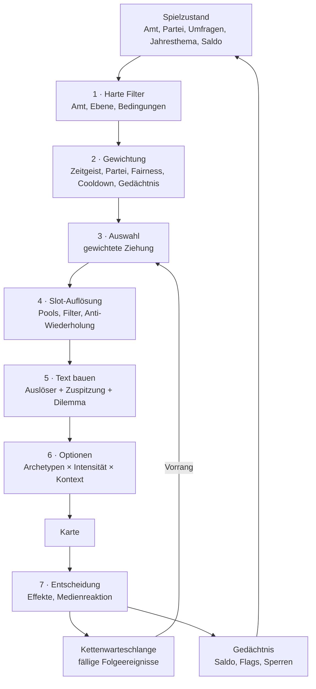
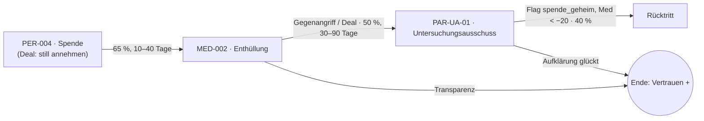

# 7 · Vollständiges Ereignis-Generator-System
# 8 · 50 Beispiel-Templates mit je 10+ Varianten
# 9 · Rechenbeispiel: Wie aus 3 000 Templates 30 000+ Ereignisse werden

> **Implementierungsstand:** Die Referenz-Engine (`tools/eventgen.js`) implementiert Slot-Auflösung, Gewichtungsformel, Wiederholungssperre, Gedächtnis, Glückssaldo und Ereignisketten. Die Datenbasis (`data/pools.json`, `data/templates50.json`) enthält **50 echte Templates** und **24 Pools**; `tools/stats.js` liefert die Zahlen dieses Kapitels. Der Prototyp nutzt denselben Ansatz in kleiner Form (16 handgeschriebene Kern-Events mit Variablen, Gewichtung, Folgeereignissen).

---

# 7 · Generator-System

## 7.1 Die Pipeline



## 7.2 Datenmodell (JSON)

### Kanonisches Ereignis-Template

```json
{
  "id": "KOM-001",
  "kategorie": "Kommunal",
  "ebene": "Kommune",
  "mindestamt": 1,
  "höchstamt": 3,
  "themen": ["Verkehr", "Wohnen"],
  "bedingungen": {
    "partei": [],
    "umfragewert": { "min": null, "max": null },
    "budget": { "min": null },
    "koalition": null,
    "jahreszeit": [],
    "vorereignisse": { "erforderlich": [], "ausgeschlossen": [] },
    "flags": { "gesetzt": [], "nicht_gesetzt": [] }
  },
  "gewicht": 1.2,
  "abklingzeit": 40,
  "slots": { "ort": "ort", "bauwerk": "bauwerk", "sum": "sum_k", "v": "verband", "m": "medium", "j": "zahl_j" },
  "textvarianten": {
    "auslöser": ["In {ort} stellt ein Gutachten fest: {bauwerk} ist „akut sanierungsbedürftig …“", "…", "…", "…"],
    "zuspitzung": ["Die Sanierung würde {sum} kosten. …", "…", "…"],
    "dilemma": "Wie gehst du mit {bauwerk.d} um?"
  },
  "optionen": [
    { "id": "a", "archetyp": "invest", "text": ["Komplettsanierung beschließen"],
      "effekte_sofort": { "bel": 2, "par": 1, "kasse": -3, "med": 1, "wirt": 2, "ges": 1 },
      "effekte_verzögert": [],
      "folgeereignisse": [] },
    { "id": "b", "archetyp": "dialog", "text": ["Bürgerversammlung: Was ist uns das wert?"],
      "effekte_sofort": { "bel": 1, "par": 1, "med": 1, "ges": 2 } },
    { "id": "c", "archetyp": "aussitzen", "text": ["Erst mal Gutachten Nr. 2 beauftragen"],
      "effekte_sofort": { "bel": -1, "med": -2 },
      "effekte_verzögert": [ { "nach_tage": [20, 60], "wahrscheinlichkeit": 0.55, "effekt": { "bel": -2, "wirt": -2 }, "schlagzeile": "Das Gutachten kostet mehr als die Sanierung." } ],
      "folgeereignisse": [ { "id": "KOM-001", "nach_tage": [20, 60], "wahrscheinlichkeit": 0.55 } ] }
  ],
  "medienreaktion": {
    "frames": { "a": "ausgaben", "b": "dialog", "c": "aussitzen" },
    "ausnahmen": { "AFD": { "a": "populismus" } }
  },
  "cutscene_id": null,
  "tags": ["infrastruktur"],
  "qa": { "autor": "…", "status": "review" }
}
```

### Kompaktes Autoren-Format (im Repo)
Zum schnellen Schreiben von ~3 000 Templates gibt es ein **kompaktes Format** (`data/templates50.json`: `a` = Auslöser, `z` = Zuspitzung, `q` = Dilemma, `o[]` = Optionen mit Archetyp, `i` = Intensität, `cd` = Abklingzeit, `w` = Gewicht, `folge` = Kette). Ein Build-Schritt expandiert es über die **Archetypen-Tabelle** (7.4) in das kanonische Format. Die Effekte einer Option werden so nicht pro Option von Hand gepflegt, sondern aus Archetyp × Intensität × Themen-Tilt berechnet.

### JSON-Schema (Auszug)

```json
{
  "$schema": "http://json-schema.org/draft-07/schema#",
  "title": "EventTemplate",
  "type": "object",
  "required": ["id", "kategorie", "ebene", "mindestamt", "höchstamt", "gewicht", "abklingzeit", "textvarianten", "optionen"],
  "properties": {
    "id": { "type": "string", "pattern": "^[A-Z]{3}-\\d{3,5}$" },
    "kategorie": { "enum": ["Kommunal","Landespolitik","Bundespolitik","Wirtschaft","Außen- und Europapolitik","Innere Sicherheit und Migration","Krisen und Katastrophen","Medien","Persönliches","Partei","Koalition","Gesellschaft und Kultur","Positives","Absurdes und Satirisches"] },
    "ebene": { "enum": ["Kommune","Land","Bund","EU","Welt"] },
    "mindestamt": { "type": "integer", "minimum": 1, "maximum": 11 },
    "höchstamt": { "type": "integer", "minimum": 1, "maximum": 11 },
    "gewicht": { "type": "number", "minimum": 0 },
    "abklingzeit": { "type": "integer", "minimum": 0, "description": "Spieltage" },
    "textvarianten": {
      "type": "object", "required": ["auslöser","zuspitzung","dilemma"],
      "properties": { "auslöser": { "type": "array", "minItems": 4 }, "zuspitzung": { "type": "array", "minItems": 3 } }
    },
    "optionen": { "type": "array", "minItems": 2, "maxItems": 4 },
    "cutscene_id": { "type": ["string","null"] }
  }
}
```

### Amtsskala (`mindestamt`, `höchstamt`)
`1` Gemeinderat · `2` Bürgermeister:in · `3` Oberbürgermeister:in · `4` Landtag · `5` Landesminister:in · `6` Ministerpräsident:in · `7` Bundestag · `8` Fraktionsvorsitz · `9` Parteivorsitz · `10` Kanzlerkandidat:in · `11` Kanzler:in

### Skalierung der Effekte je Ebene
Effekte werden in **abstrakten Einheiten** gespeichert und beim Anwenden skaliert: `Kasse`: Kommune ×10 k€ · Land ×10 Mio. € · Bund ×1 Mrd. €. Die Texte werden entsprechend aus Summen-Pools gezogen (`sum_k`, `sum_m`, `sum_g`).

## 7.3 Variablenpools

Jeder Platzhalter im Text (`{ort}`, `{person}`, `{bauwerk.d}` …) verweist auf einen **Pool**. Drei Pooltypen:

| Typ | Beschreibung | Beispiel |
|---|---|---|
| `list` | feste Liste (auch mit Kasusformen `{n,a,d}`) | `bauwerk`: „die Stadthalle / die Stadthalle / der Stadthalle“ |
| `product` | kartesisches Produkt aus Teillisten | `ort`: Präfix × Stamm × Suffix → 2 880 Ortsnamen |
| `range` | Zahlenbereich | `zahl_s`: 40–2 400 in 20er-Schritten |

**Kasus:** `{bauwerk}` = Nominativ, `{bauwerk.a}` = Akkusativ, `{bauwerk.d}` = Dativ – Sätze bleiben grammatisch. **Satzanfang:** ein Post-Processor setzt Großbuchstaben nach Satzenden.

| Pool | Größe | Inhalt |
|---|--:|---|
| `ort` | 2 880 | fiktive Orte (z. B. *Niederhüttingen*, *Bad Lindenau*) |
| `person` | 3 100 | Vorname × Nachname (fiktiv) |
| `firma` | 3 000 | Familienname × Branchenwort × Rechtsform |
| `projekt` | 96 | Projektnamen („Zukunftsquartier 2030“) |
| `zahl_s` | 119 | Stellen/Zahlen 40–2 400 |
| `zahl_p` | 35 | Prozent 4–38 |
| `zahl_j` | 40 | Jahre 3–42 |
| `branche` | 30 | Wirtschaftsbranchen |
| `gesetz` | 24 | Gesetzes-Kurztitel |
| `verband` | 16 | Vereine, Kammern, Gewerkschaft … |
| `ministerium` | 14 | Ressorts |
| `land` | 12 | Bundesländer |
| `thema` | 11 | die elf Wahlkampfthemen |
| `sum_k / sum_m / sum_g` | je 12 | Summen nach Ebene (k€ … Mrd.) |
| `medium`, `medium_nat` | je 10 | fiktive Medien (lokal/national) |
| `stimmung`, `wetter`, `fest`, `tier`, `bauwerk`, `jahreszeit` | 4–10 | Kontext & Atmosphäre |

**Produktionsziel:** `ort` 12 000 (kreative Wortbildung + PLZ-Flavor), `person` 8 000, `firma` 8 000, `projekt` 500, `gesetz` 300, `verband` 120 – der Generator skaliert ohne Codeänderung.

**Slot-Filter (Vertical Slice):** Pool-Einträge tragen Tags (`region:ost`, `branche:industrie`, `ton:ernst`). Ein Template kann `slots: { "ort": { "pool": "ort", "filter": "region:süd" } }` fordern, um Dialekt/Bundesland-Logik abzubilden.

## 7.4 Options-Archetypen

Optionen werden nicht einzeln verrechnet, sondern aus **zwölf Archetypen** abgeleitet. Effektvektor je Archetyp (vor Skalierung), `i` = Intensität des Templates (1–3), Skalierung `0,6 + 0,4·i`:

| Archetyp | Bel | Par | Kasse | Med | Wirt | Umw | Ges | Stress | Folgerisiko |
|---|--:|--:|--:|--:|--:|--:|--:|--:|--:|
| **invest** – Geld in die Hand nehmen | +2 | +1 | −3 | +1 | +2 | 0 | +1 | +1 | 10 % |
| **sparen** – konsolidieren | −2 | 0 | +3 | −1 | −1 | 0 | −1 | 0 | 15 % |
| **dialog** – Beteiligung | +1 | +1 | 0 | +1 | 0 | 0 | +2 | +1 | 5 % |
| **durchgreifen** – Härte | +1 | −1 | 0 | +2 | 0 | 0 | −2 | +2 | 20 % |
| **aussitzen** | −1 | 0 | 0 | −2 | 0 | 0 | 0 | −1 | **35 %** |
| **populär** – Gefälligkeit | +4 | −1 | −1 | +2 | −1 | −1 | −1 | 0 | **30 %** |
| **transparenz** | +1 | −1 | 0 | +2 | 0 | 0 | +2 | +1 | 5 % |
| **deal** – Hinterzimmer | 0 | +2 | +2 | −2 | +1 | 0 | −1 | 0 | **30 %** |
| **grün** – nachhaltig | +1 | 0 | −2 | +1 | −1 | +3 | +1 | +1 | 10 % |
| **delegieren** | 0 | 0 | −1 | 0 | 0 | 0 | 0 | −2 | 15 % |
| **konter** – Gegenangriff | +1 | +1 | 0 | +1 | 0 | 0 | −2 | +1 | 25 % |
| **humor** | +2 | 0 | 0 | +2 | 0 | 0 | +1 | −1 | 20 % |

Die **Folgerisiko**-Spalte speist die Ereignisketten (7.8): `p_Folge = 0,35 + Risiko(Archetyp)` (wenn das Template eine Kette definiert). *Aussitzen* und *Deal* haben die höchsten Risiken – das ist Spielinhalt.

## 7.5 Gewichtungsformel

```
w(t) = w₀ · F_cool · F_novelty · F_zeit · F_kat · F_fair · F_partei · F_kette      (0, wenn ein harter Filter verletzt ist)
```

| Faktor | Formel | Wertebereich | Wirkung |
|---|---|---|---|
| **Harte Filter** | Amt ∈ [min; max]; Bedingungen (Partei, Umfragewert, Budget, Koalition, Jahreszeit, Vorereignisse, Flags) | 0 / 1 | schließt Unpassendes aus |
| **Harte Sperre** | `Δtage < 0,25 · Abklingzeit` → 0 | 0 / 1 | Mindestabstand |
| **F_cool** | `1 − exp(−1,8 · Δtage / Abklingzeit)` | 0 … 1 | sanfte Erholung |
| **F_novelty** | `1 / (1 + 0,35 · bereits_gesehen)` | 1 → 0,3 | Gedächtnis: Häufiges wird seltener |
| **F_zeit** (Zeitgeist) | `1 + 0,6 · [Template-Thema = Jahresthema]` | 1 / 1,6 | Jahresthemen prägen die Auswahl |
| **F_kat** (Balance) | `1 / (1 + 0,5 · Anzahl_Kategorie_in_letzten_12)` | 1 → 0,4 | verhindert Kategorie-Serien |
| **F_fair** | Positive Kategorien: `clamp(1 − Saldo/6; 0,4; 2,0)`; negative (Krisen, Persönliches): `clamp(1 + Saldo/12; 0,4; 1,6)` | 0,4 … 2,0 | Glück/Pech gleicht sich aus (7.7) |
| **F_partei** | `1,25`, wenn Template-Thema ∈ Parteithemen | 1 / 1,25 | Partei-Identität |
| **F_kette** | `×4`, wenn ein Folgeereignis „gebucht“ ist | 1 / 4 | Ketten haben Vorrang |
| Berufs-/Persönlichkeitsaffinität (Prototyp) | `×1,35`, wenn Beruf-Thema passt; Stress > 50 erhöht Familien-/Gesundheits-Events | 1 … 2,2 | Figur prägt die Welt |

Die Ziehung ist **gewichtet-zufällig** (`P(t) = w(t)/Σw`), mit festem Seed für Reproduzierbarkeit (Replay, Ranglisten).

## 7.6 Wiederholungssperre und Gedächtnis

Vier Ebenen verhindern, dass sich etwas wiederholt:

| Ebene | Mechanik | Parameter |
|---|---|---|
| **1 · Template-Abklingzeit** | hart 25 %, weich nach `F_cool` | `cd` in Spieltagen (30–120) |
| **2 · Gedächtnis** | `lastSeen[id]`, `count[id]`, `F_novelty` | je Partie persistent, im Save |
| **3 · Text-Signatur** | Die *sichtbare* Textfolge wird gehasht; bei Duplikat werden Slots/Varianten **neu gezogen** (bis 12 Versuche) | Ring-Puffer der letzten **4 000** Signaturen |
| **4 · Slot-Gedächtnis** (Vertical Slice) | Letzte *n* Werte je Pool (`person`, `firma`, `ort`) sind gesperrt | n = 40 (Personen), 25 (Orte), 15 (Firmen) |

**Kategorie-Balance** (`F_kat`): In den letzten 12 Ereignissen zählt jede Kategorie; je mehr, desto geringer ihr Gewicht – keine fünf Skandale hintereinander.

## 7.7 Zufall mit Fairness (Glückssaldo)

`Saldo S` ∈ [−12; +12] (positiv = Glückssträhne): nach jedem Zufallswurf `S ← 0,92·S + (Erfolg ? +1 : −1)`.

```
Erfolgswahrscheinlichkeit (Fair):  p = clamp(p₀ − 0,05·S; 0,2; 0,8)
Ereignisauswahl:   positive Kategorien F = clamp(1 − S/6; 0,4; 2,0),  Krisen/Persönliches F = clamp(1 + S/12; 0,4; 1,6)
```

**Messung** (`tools/stats.js`, 1 800 Würfe je Lauf): mit Fairness **längste Strähne 7**, **0 von 36** Fenster (à 50 Würfe) mit > 60 % Glück oder Pech; ohne Fairness **Strähne 10**, **5 von 36** Fenster. Der Glücksanteil bleibt bei ≈ 50 % – nur die *Verteilung* wird gleichmäßiger.

## 7.8 Ereignisketten („Schmetterlingseffekt“)

Ketten sind **Zustandsmaschinen**: Eine Entscheidung *bucht* ein Folgeereignis mit Verzögerung und Wahrscheinlichkeit in die **Kettenwarteschlange** (`queue[{id, fälligAm}]`).

```json
{
  "kette": "SPENDENAFFÄRE",
  "schritte": [
    { "id": "PER-004", "auslöser": "start" },
    { "id": "MED-002", "wenn": { "gewählt": ["PER-004:deal"] }, "nach_tage": [10, 40], "p": 0.65 },
    { "id": "PAR-UA-01", "wenn": { "gewählt": ["MED-002:konter","MED-002:deal"] }, "nach_tage": [30, 90], "p": 0.50 },
    { "id": "PER-RÜCKTRITT", "wenn": { "flags": ["spende_geheim"], "med": "<-20" }, "nach_tage": [15, 45], "p": 0.40 }
  ],
  "abbruch": ["transparenz_früh"], "max_tiefe": 4
}
```



**Regeln:** max. Kettentiefe 4 · fällige Kettenglieder haben **Vorrang** vor normalen Ereignissen · `F_kette ×4` zieht Glieder im Gewichtslauf nach vorn, falls kein Termin fällig ist · Flags und Gedächtnis sorgen dafür, dass spätere Ereignisse **Bezug nehmen** (Text-Varianten `{früher.person}`).

**Im Prototyp:** `later: { after, chance, hl|card, fx }` – z. B. *Hinterzimmer-Deal → Enthüllung im Stadtrat*, *Aussitzen → Firma verlagert Teilbetrieb*, *stille Spende → Reporter-Anfrage* (EV-009 → EV-005).

## 7.9 Jahresthemen und Zeitgeist

Alle 26 Wochen wechselt das **Jahresthema** (Energiekrise, Wohnungsnot, Sicherheitsdebatte, Digitalisierung, Pflegenotstand, Bildungsdebatte …). Es erhöht `F_zeit` (×1,6) für passende Templates, verschiebt Themen-Salienz (`sal(t) += 0,05`) und liefert Headlines für die Nachrichten-Leiste. Übergänge sind *geglättet* (2 Wochen Überlappung).

## 7.10 Authoring- und QA-Workflow

1. Autor:in schreibt Template im kompakten Format (Auslöser × 4, Zuspitzung × 3, Dilemma, 2–4 Archetyp-Optionen).
2. **Lint** (`eventgen.lint()`): Slots definiert/genutzt? ≥ 4 Auslöser, ≥ 3 Zuspitzungen? Archetypen gültig? IDs eindeutig? → aktuell **0 Fehler** über alle 50 Templates.
3. **Sample-Report**: 30 zufällige Instanzen ansehen (Grammatik, Kasus, Ton).
4. **Balance-Check**: Effekt-Summen je Kategorie/Archetyp; Variations-Zählung (Kap. 9).
5. **Fairness-Review**: Darstellung aller Parteien gleichwertig (Kap. 3.0), keine Herabwürdigung.
6. Merge → Telemetrie (Vertical Slice+): Wahlhäufigkeit je Option, „Skip“-Rate, Wiederholungsbeschwerden.

---

# 8 · Die 50 Beispiel-Templates

Jedes Template erzeugt **mindestens 12 Textvarianten** (4 Auslöser × 3 Zuspitzungen), bevor Slots (Orte, Personen, Firmen, Summen …) multipliziert werden. Die Tabelle wird aus `data/templates50.json` erzeugt (`tools/make-template-table.js`). *Kombinationen (roh)* = Textvarianten × Produkt der Pool-Größen aller genutzten Slots.

**Verteilung:** Kommunal 5 · Landespolitik 3 · Bundespolitik 4 · Wirtschaft 4 · Außen-/Europapolitik 3 · Innere Sicherheit/Migration 4 · Krisen/Katastrophen 4 · Medien 4 · Persönliches 4 · Partei 3 · Koalition 3 · Gesellschaft/Kultur 3 · Positives 3 · Absurdes/Satirisches 3 = **50**.

| # | ID | Kategorie | Ebene · Amt | Kern-Dilemma (Skelett) | Slots | Text-Varianten | Kombinationen (roh) |
|--:|---|---|---|---|---|--:|--:|
| 1 | KOM-001 | Kommunal | Kommune · Gemeinderat–OB | In ⟨ort⟩ stellt ein Gutachten fest: ⟨bauwerk⟩ ist „akut sanierungsbedürftig, aber optisch… | ort, bauwerk, m, j, v, sum | 4×3=12 | 26,5 Mrd. |
| 2 | KOM-002 | Kommunal | Kommune · Gemeinderat–OB | ⟨person⟩ sammelt in ⟨ort⟩ Unterschriften gegen das Projekt „⟨p⟩“ – mit Klemmbrett, Thermo… | person, ort, p, v, sum | 4×3=12 | 2,0 Bio. |
| 3 | KOM-003 | Kommunal | Kommune · Gemeinderat–OB | Bei ⟨fest⟩ in ⟨ort⟩ reicht dir ⟨person⟩ einen Holzhammer: „Jetzt zeigen Sie mal, was Sie … | fest, ort, person, st, v | 4×3=12 | 137,1 Mrd. |
| 4 | KOM-004 | Kommunal | Kommune · Gemeinderat–OB | Der Plan: In ⟨ort⟩ soll ein Radstreifen entstehen. Dafür müssten ⟨p⟩ Parkplätze weichen –… | ort, p, v, j, person | 4×3=12 | 2,4 Bio. |
| 5 | KOM-005 | Kommunal | Kommune · Gemeinderat–OB | In ⟨ort⟩ fehlen Kita-Plätze. Der Elternbeirat legt eine Liste mit Namen vor, die länger i… | ort, v, m, zs, sum | 4×3=12 | 7,9 Mrd. |
| 6 | LAN-001 | Landespolitik | Land · Landtag–MP | Das Land ⟨land⟩ stellt ⟨sum⟩ für das Projekt „⟨p⟩“ bereit – mit dem Vermerk „Verteilung f… | land, sum, p, m, ort | 4×3=12 | 4,8 Mrd. |
| 7 | LAN-002 | Landespolitik | Land · Landtag–MP | Das ⟨land⟩-Bildungsministerium plant, ⟨zs⟩ Lehrerstellen umzuschichten. Die Gewerkschaft … | land, zs, ort, person, v | 4×3=12 | 2,4 Bio. |
| 8 | LAN-003 | Landespolitik | Land · Landtag–MP | Beim Länderfinanzausgleich wird ⟨land⟩ zum Zahlmeister. ⟨person⟩ spricht von „fiskalische… | land, person, ministerium, sum | 4×3=12 | 75,0 Mio. |
| 9 | BUN-001 | Bundespolitik | Bund · Bundestag–Kanzler:in | Der Entwurf des ⟨gesetz⟩ liegt im Ausschuss – ⟨person⟩ sagt: „Da fehlen mir ein paar Komm… | gesetz, person, ministerium, m | 4×3=12 | 125,0 Mio. |
| 10 | BUN-002 | Bundespolitik | Bund · Bundestag–Kanzler:in | ⟨person⟩ aus deiner Fraktion kündigt an, beim ⟨gesetz⟩ mit Nein zu stimmen – „aus Gewisse… | person, gesetz, zs, v | 4×3=12 | 1,7 Mrd. |
| 11 | BUN-003 | Bundespolitik | Bund · Bundestag–Kanzler:in | In der Haushaltswoche fehlen ⟨sum⟩. Das ⟨ministerium⟩ rät „kreative Buchungslösungen“. | sum, ministerium, person, gesetz | 4×3=12 | 150,0 Mio. |
| 12 | BUN-004 | Bundespolitik | Bund · Bundestag–Kanzler:in | In der Regierungsbefragung fragt ⟨person⟩ nach dem Stand des ⟨gesetz⟩. Die Antwort beginn… | person, gesetz, ministerium, m | 4×3=12 | 125,0 Mio. |
| 13 | WIR-001 | Wirtschaft | Kommune · Bürgermeister:in–MP | ⟨firma⟩ aus ⟨ort⟩ droht mit Verlagerung: ⟨zs⟩ Arbeitsplätze stehen auf dem Spiel, sagt In… | firma, ort, zs, person, m, sum | 4×3=12 | 4589,7 Bio. |
| 14 | WIR-002 | Wirtschaft | Land · Landtag–Kanzler:in | In der Branche ⟨branche⟩ fehlen in ⟨land⟩ rund ⟨zs⟩ Fachkräfte – zumindest laut ⟨v⟩. | branche, land, zs, v | 4×3=12 | 8,2 Mio. |
| 15 | WIR-003 | Wirtschaft | Bund · Minister:in (Land)–Kanzler:in | Die Energiepreise treffen ⟨branche⟩ besonders hart: Die Kosten sind um ⟨p⟩ Prozent gestie… | branche, p, sum, gesetz | 4×3=12 | 3,6 Mio. |
| 16 | WIR-004 | Wirtschaft | Kommune · Bürgermeister:in–MP | Ein Start-up aus ⟨ort⟩ will mit „⟨p⟩“ die Stadt digitalisieren und benötigt dafür erstmal… | ort, p, sum, person, m | 4×3=12 | 1,2 Bio. |
| 17 | AUS-001 | Außen- und Europapolitik | EU · MP–Kanzler:in | Brüssel legt die Richtlinie zum ⟨gesetz⟩ vor. Der Text umfasst 47 Artikel und eine Fußnot… | gesetz, person, m, land | 4×3=12 | 107,1 Mio. |
| 18 | AUS-002 | Außen- und Europapolitik | Welt · Minister:in (Land)–Kanzler:in | Ein Handelsabkommen über ⟨sum⟩ steht bevor. ⟨person⟩ vom Verband der Branche ⟨branche⟩ ju… | sum, person, branche, m | 4×3=12 | 133,9 Mio. |
| 19 | AUS-003 | Außen- und Europapolitik | Welt · MP–Kanzler:in | Ein Energielieferant droht, die Verträge zu kündigen. Es geht um ⟨sum⟩ und um Prinzipien. | sum, person, m, branche | 4×3=12 | 133,9 Mio. |
| 20 | SIC-001 | Innere Sicherheit und Migration | Kommune · Bürgermeister:in–MP | Am Abend häufen sich in ⟨ort⟩ Sachbeschädigungen rund um ⟨bauwerk⟩. Die Anwohner:innen si… | ort, bauwerk, v, m, person | 4×3=12 | 171,4 Mrd. |
| 21 | SIC-002 | Innere Sicherheit und Migration | Kommune · Bürgermeister:in–MP | Das Land weist ⟨ort⟩ kurzfristig ⟨zs⟩ Geflüchtete zu. Eine Unterkunft gibt es nicht. | ort, zs, bauwerk, v, m | 4×3=12 | 6,6 Mrd. |
| 22 | SIC-003 | Innere Sicherheit und Migration | Land · Landtag–MP | Die Polizeigewerkschaft in ⟨land⟩ verlangt ⟨zs⟩ zusätzliche Stellen und bessere Ausrüstung. | land, zs, v, m, sum | 4×3=12 | 32,9 Mio. |
| 23 | SIC-004 | Innere Sicherheit und Migration | Land · Bürgermeister:in–MP | In ⟨ort⟩ sind für Samstag zwei Demonstrationen angemeldet. Beide wollen auf dem Marktplat… | ort, v, zs, m, person | 4×3=12 | 2,0 Bio. |
| 24 | KRI-001 | Krisen und Katastrophen | Kommune · Gemeinderat–MP | Nach ⟨wetter⟩ steigt der Pegel in ⟨ort⟩ stündlich. Die Feuerwehr bittet um Sandsäcke und … | wetter, ort, v, zs, m | 4×3=12 | 6,6 Mrd. |
| 25 | KRI-002 | Krisen und Katastrophen | Land · Landtag–MP | Nach ⟨wetter⟩ droht in ⟨land⟩ ein Ernteausfall. ⟨v⟩ spricht von „existenzieller Lage“ für… | wetter, land, v, branche, sum | 4×3=12 | 8,3 Mio. |
| 26 | KRI-003 | Krisen und Katastrophen | Bund · Minister:in (Land)–Kanzler:in | Ein Cyberangriff legt die Krankenhäuser in ⟨ort⟩ lahm: ⟨zs⟩ Patient:innen werden verlegt. | ort, zs, sum, m, person | 4×3=12 | 1,5 Bio. |
| 27 | KRI-004 | Krisen und Katastrophen | Land · Landtag–Kanzler:in | Wegen ⟨wetter⟩ steht der Bahnverkehr still: ⟨zs⟩ Fahrgäste stranden in Hallen mit schlech… | wetter, zs, person, m, v | 4×3=12 | 7,1 Mrd. |
| 28 | MED-001 | Medien | Bund · Gemeinderat–Kanzler:in | Ein Foto von vor ⟨jahr⟩ Jahren taucht auf: du, ein Bierglas, eine Kopfbedeckung, die man … | jahr, person, m, v | 4×3=12 | 238,1 Mio. |
| 29 | MED-002 | Medien | Kommune · Gemeinderat–Kanzler:in | ⟨person⟩ vom ⟨m⟩ hat Unterlagen: Dein Verband hat ⟨sum⟩ von ⟨firma⟩ erhalten. Es wird „na… | person, m, sum, firma | 4×3=12 | 13,4 Mrd. |
| 30 | MED-003 | Medien | Bund · Gemeinderat–Kanzler:in | Ein Video kursiert: Du sagst einen Satz, den du nie gesagt hast – mit erstaunlich viel Üb… | zs, person, st, m | 4×3=12 | 354,1 Mio. |
| 31 | MED-004 | Medien | Bund · MP–Kanzler:in | Die Talkshow im ⟨m⟩ lädt dich ein – Thema: ⟨thema⟩. Dein Gegenüber ist ⟨person⟩, bekannt … | m, thema, person, st | 4×3=12 | 32,7 Mio. |
| 32 | PER-001 | Persönliches | Bund · Gemeinderat–Kanzler:in | Ein Plagiatsjäger findet in deiner Abschlussarbeit vor ⟨jahr⟩ Jahren 41 „unmarkierte Geda… | jahr, person, m, v | 4×3=12 | 238,1 Mio. |
| 33 | PER-002 | Persönliches | Bund · Gemeinderat–Kanzler:in | Dein Arzt warnt: Die Stresswerte sind auf einem Niveau, das „für einen Menschen unüblich,… | person, jahreszeit, st, m | 4×3=12 | 11,9 Mio. |
| 34 | PER-003 | Persönliches | Kommune · Gemeinderat–Kanzler:in | Dein Kind hat heute Einschulung. Gleichzeitig beginnt in ⟨ort⟩ ⟨fest⟩. Beide Termine sind… | ort, fest, person, st | 4×3=12 | 8,6 Mrd. |
| 35 | PER-004 | Persönliches | Bund · Bürgermeister:in–Kanzler:in | ⟨firma⟩ möchte dir ⟨sum⟩ spenden. Es sei „nur Unterstützung für gute Politik“. | firma, sum, person, m | 4×3=12 | 13,4 Mrd. |
| 36 | PAR-001 | Partei | Kommune · Gemeinderat–Parteivorsitz | ⟨person⟩ aus dem Ortsverband ⟨ort⟩ sagt im ⟨m⟩: „Wir brauchen frischen Wind.“ Gemeint bis… | person, ort, m, v | 4×3=12 | 17,1 Mrd. |
| 37 | PAR-002 | Partei | Bund · Bundestag–Kanzler:in | Auf dem Parteitag steht ein Antrag zum Thema ⟨thema⟩ auf der Tagesordnung – es ist ein St… | thema, person, gesetz, v | 4×3=12 | 157,1 Mio. |
| 38 | PAR-003 | Partei | Bund · Fraktionsvorsitz–Kanzler:in | Die Partei lässt die Basis über ⟨thema⟩ abstimmen: ⟨zs⟩ Mitglieder sind bereits online, d… | thema, zs, person, v | 4×3=12 | 779,1 Mio. |
| 39 | KOA-001 | Koalition | Bund · Bundestag–Kanzler:in | Der Koalitionspartner zweifelt am ⟨gesetz⟩: „So nicht, und wenn, dann anders.“ | gesetz, person, m, ministerium | 4×3=12 | 125,0 Mio. |
| 40 | KOA-002 | Koalition | Bund · Parteivorsitz–Kanzler:in | In der Nachtsitzung der Koalitionsverhandlung geht es um das ⟨ministerium⟩. Um 3 Uhr morg… | ministerium, st, person, v | 4×3=12 | 66,7 Mio. |
| 41 | KOA-003 | Koalition | Bund · Kanzlerkandidat:in–Kanzler:in | Die Koalition wankt: Bei der Abstimmung zum ⟨gesetz⟩ fehlen ⟨zs⟩ Stimmen der Regierungsfr… | gesetz, zs, person, m | 4×3=12 | 1,1 Mrd. |
| 42 | GES-001 | Gesellschaft und Kultur | Kommune · Gemeinderat–Kanzler:in | Vor dem Rathaus in ⟨ort⟩ demonstrieren ⟨zs⟩ Menschen zum Thema ⟨thema⟩. Es gibt Plakate, … | ort, zs, thema, v | 4×3=12 | 723,8 Mio. |
| 43 | GES-002 | Gesellschaft und Kultur | Bund · Gemeinderat–Kanzler:in | Die Europameisterschaft steht an. In ⟨ort⟩ soll ein Public Viewing stattfinden – Kosten: … | ort, sum, v, st, person | 4×3=12 | 164,6 Mrd. |
| 44 | GES-003 | Gesellschaft und Kultur | Kommune · Bürgermeister:in–MP | In ⟨ort⟩ entbrennt Streit um die Umbenennung einer Straße. ⟨person⟩ nennt es „Vergangenhe… | ort, person, v, m | 4×3=12 | 17,1 Mrd. |
| 45 | POS-001 | Positives | Kommune · Gemeinderat–Kanzler:in | ⟨ort⟩ wird für „besonders lebenswerte Stadtentwicklung“ ausgezeichnet. Preisgeld: ⟨sum⟩. | ort, sum, m, branche, person | 4×3=12 | 385,7 Mrd. |
| 46 | POS-002 | Positives | Kommune · Bürgermeister:in–Kanzler:in | ⟨firma⟩ siedelt sich in ⟨ort⟩ an: ⟨zs⟩ neue Arbeitsplätze, ⟨sum⟩ an Investitionen. | firma, ort, zs, sum, m | 4×3=12 | 1,5 Bio. |
| 47 | POS-003 | Positives | Land · Bürgermeister:in–Kanzler:in | Überraschend bietet dir ⟨person⟩ aus dem gegnerischen Lager Zusammenarbeit beim Thema ⟨th… | person, thema, m, sum | 4×3=12 | 49,1 Mio. |
| 48 | ABS-001 | Absurdes und Satirisches | Kommune · Gemeinderat–Kanzler:in | In ⟨ort⟩ hat ⟨tier⟩ die Regie übernommen: Der Verkehr steht, die Stadt schaut zu. | ort, tier, m, bauwerk, v | 4×3=12 | 553,0 Mio. |
| 49 | ABS-002 | Absurdes und Satirisches | Kommune · Gemeinderat–Kanzler:in | Ein Formular aus dem ⟨ministerium⟩ verlangt, dass man in ⟨ort⟩ für eine Hundemarke einen … | ministerium, ort, zs, m, j | 4×3=12 | 23,0 Mrd. |
| 50 | ABS-003 | Absurdes und Satirisches | Kommune · Gemeinderat–Kanzler:in | ⟨person⟩ beantragt in ⟨ort⟩, dass ⟨fest⟩ künftig „ohne Lärm, ohne Menschen und ohne Bier“… | person, ort, fest, v, sum | 4×3=12 | 205,7 Mrd. |


**Beispielinstanzen** (Seed 42, aus dem Generator):

> **[PER-001]** *Zeynep Vogelsang behauptet, Teile deiner Doktorarbeit klängen „bemerkenswert vertraut“. Das Sonntagsblatt fragt nach. Die Universität kündigt eine Kommission an. Die Kommission tagt nicht öffentlich, aber das Sonntagsblatt schon.* – Wie gehst du mit den Vorwürfen um? · *Selbst prüfen lassen, Ergebnis veröffentlichen* (Transparenz) / *Vorwürfe als Schmutzkampagne zurückweisen* (Konter) / *Nichts sagen, Kommission abwarten* (Aussitzen)

> **[KOM-001]** *Der Elternbeirat kippt vor laufender Kamera einen Eimer Wasser aus: „So sieht es in dem Feuerwehrhaus aus!“ Die Opposition fordert sofortiges Handeln, die Verwaltung ein Gutachten zum Gutachten.* – Wie gehst du mit dem Feuerwehrhaus um? · *Komplettsanierung beschließen* / *Bürgerversammlung: Was ist uns das wert?* / *Erst mal Gutachten Nr. 2 beauftragen*

> **[KOM-002]** *Der Sportverein 1898 lädt zur Info-Veranstaltung über „Gewerbeachse Neu“. Es kommen 300 Leute, vorgesehen waren 40 Stühle. Das Projekt soll 900.000 Euro in die Stadt bringen – und angeblich auch ein paar Bäume fällen.* – Wie positionierst du dich zu „Gewerbeachse Neu“?

---

# 9 · Rechenbeispiel: Aus 3 000 Templates werden 30 000+ Ereignisse

## 9.1 Die Formel

```
V(t)  =  T_A · T_Z  ·  Π_{s ∈ Slots(t)} |Pool_s|  ·  O_t  ·  K_t
         └Text┘         └──── Slot-Kombinationen ───┘ └Optionen┘ └Kontext┘
T_A = Anzahl Auslöser (≥ 4), T_Z = Zuspitzungen (≥ 3), O_t = Options-Formulierungs-Varianten, K_t = Kontext-Overlays
```

**Gesamtzahl:** `N = Σ_t V(t)`. Weil Orte, Personen und Firmen riesige Pools haben, ist `N` astronomisch – aber **nicht jede Kombination wird als verschieden wahrgenommen**. Deshalb zählen wir in drei Stufen.

## 9.2 Drei Zählstufen

| Stufe | Annahme | Pro Template | Bei 3 000 Templates |
|---|---|--:|--:|
| **A · Garantie** (nur Text) | nur 4 × 3 Text-Varianten, *keine* Slots gezählt | **12** | **36 000** ✓ (Mindestziel 30 000) |
| **B · Konservativ** (Wahrnehmungs-Deckel) | jeder Pool zählt nur *CAP* verschiedene Werte, nur die **2 prägnantesten Slots** | CAP = 3: **108**<br/>CAP = 5: **300**<br/>CAP = 10: **1 200** | **324 000**<br/>**900 000**<br/>**3 600 000** |
| **C · Roh** | alle Slots unabhängig | geom. Mittel **3,9 × 10⁹** | ≈ 10¹³ |

*Gemessen* an den 50 Templates: Mit CAP = 3 ergeben sich 5 400 wahrnehmbar verschiedene Ereignisse (Ø 108/Template); mit CAP = 10 bereits **60 000**. Hochgerechnet auf 3 000 Templates (Faktor 60) ist das **Mindestziel 30 000 um Faktor 10 bis 100 übertroffen**.

### Aggregierte Messwerte (aus `tools/stats.js`)

| Kennzahl | Wert |
|---|--:|
| Templates | 50 |
| Textvarianten je Template (Minimum) | 12 |
| Ø Slot-Produkt je Template | 7,7 × 10¹² |
| Geometrisches Mittel der Gesamtvarianten | 3,9 × 10⁹ |
| Summe aller Roh-Kombinationen (50 Templates) | 4,6 × 10¹⁵ |
| Kleinste Gesamtzahl (Wirtschaft, `WIR-…`) | 3,6 × 10⁶ |

## 9.3 Wahrnehmungs-Signatur

Zwei Ereignisse gelten als **visuell verschieden**, wenn sich ihre Signatur `(Template, Auslöser-ID, Zuspitzungs-ID, Slot 1 (gebündelt), Slot 2 (gebündelt))` unterscheidet – Slot-Werte werden in `CAP` Klassen gebündelt (z. B. *Orte mit gleichem Anlaut*, *Summen in derselben Größenordnung*). So wird vermieden, dass „nur der Ortsname anders“ als neues Ereignis zählt.

## 9.4 20-Stunden-Test (Worst Case: nur 50 statt 3 000 Templates)

Annahme: **90 Ereignisse pro Spielstunde** (Ø 40 s) → 20 h ≈ **1 800 Ereignisse**.

| Lauf | Ereignisse | Identische Volltexte | Template-Wiederkehr (Median / 5 %-Perzentil) | Glücksanteil | Längste Strähne | Strähnenfenster |
|---|--:|--:|---|--:|--:|--:|
| 20 h · Kommune → Bund · **mit** Fairness | 1 800 | **0** | 25 / 9 Ereignisse | 51,2 % | 7 | 0 / 36 |
| 20 h · Kommune → Bund · **ohne** Fairness | 1 800 | **0** | 25 / 8 | 51,6 % | 10 | 5 / 36 |
| 20 h · nur Bund-Ebene · mit Fairness | 1 800 | **0** | 25 / 9 | 49,9 % | 7 | 0 / 36 |
| 100 h Dauertest (nur 50 Templates) | 9 000 | 508 (5,6 %)* | 26 / 9 | 49,8 % | 9 | 0 / 180 |

\* Nach 4 000 Ereignissen fällt die Signatur-Sperre aus dem Ringpuffer; bei nur 50 Templates kehren Textfolgen dann zwangsläufig zurück. Bei **3 000** Templates sinkt die Duplikatrate proportional (Faktor 60).

## 9.5 Hochrechnung auf 3 000 Templates

- **Template-Wiederkehr** (gleiches Dilemma, andere Slots/Texte): Median ≈ 25 × (3 000 / 50) = **1 500 Ereignisse ≈ 17 Spielstunden** (bei Filterung auf ≈ 40 % der Templates je Amt/Ebene: Median ≈ 600 Ereignisse ≈ **7 h**, 5 %-Perzentil ≈ 200 Ereignisse ≈ **2 h**).
- **Identische Volltexte innerhalb 20 h:** 0 – selbst mit nur 50 Templates. Mit 3 000 Templates und zusätzlichen Kontext-Overlays (z. B. 9 Partei-Zusatzsätze je Template, Faktor bis 9) ist der Abstand weitere Größenordnungen größer.
- **Ziel erreicht:** ≥ 30 000 wahrnehmbar verschiedene Ereignisse, keine sichtbare Wiederholung innerhalb von 20 Spielstunden.

## 9.6 Aufbau der 3 000 Templates (Produktionsplan)

| Kategorie | Ziel-Templates | → Ereignisse (CAP = 3) | → Ereignisse (CAP = 10) |
|---|--:|--:|--:|
| Kommunal | 300 | 32 400 | 360 000 |
| Landespolitik | 200 | 21 600 | 240 000 |
| Bundespolitik | 250 | 27 000 | 300 000 |
| Wirtschaft | 250 | 27 000 | 300 000 |
| Außen- und Europapolitik | 200 | 21 600 | 240 000 |
| Innere Sicherheit und Migration | 250 | 27 000 | 300 000 |
| Krisen und Katastrophen | 250 | 27 000 | 300 000 |
| Medien | 250 | 27 000 | 300 000 |
| Persönliches | 250 | 27 000 | 300 000 |
| Partei | 200 | 21 600 | 240 000 |
| Koalition | 150 | 16 200 | 180 000 |
| Gesellschaft und Kultur | 250 | 27 000 | 300 000 |
| Positives | 100 | 10 800 | 120 000 |
| Absurdes und Satirisches | 100 | 10 800 | 120 000 |
| **Summe** | **3 000** | **324 000** | **3 600 000** |

Die Vorgabe „je Kategorie mindestens 1 500 Ereignisse“ ist **schon durch die Textvarianten allein** erfüllt, sobald eine Kategorie ≥ 125 Templates hat (125 × 12 = 1 500). Die kleinsten Kategorien (Positives, Absurdes: je 100 Templates) kommen mit nur *einer* gezählten Slot-Achse (CAP = 3: ×3) auf 3 600 und mit zwei Achsen auf 10 800.

**Aufwand:** 3 000 Templates × (4 + 3 Textbausteine + Dilemma + 3 Optionen ≈ 11 Zeilen) ≈ 33 000 Zeilen; bei 40 Zeilen/Stunde inkl. Review ≈ 830 Autor:innen-Stunden (≈ 5 Personenmonate) – parallelisierbar; KI-gestützte Erstentwürfe (mit Lint + menschlichem Lektorat) verkürzen das.
