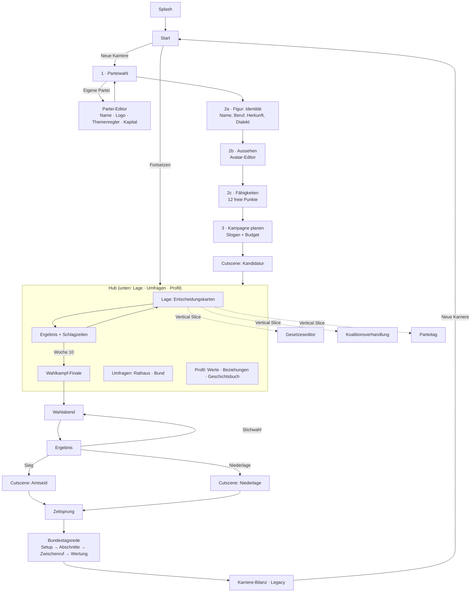

# 11 · UI/UX-Konzept: Screen-Flow und Wireframes (Mobile)
# 12 · Cutscene-Drehbuch für drei Schlüsselmomente

> **Implementierungsstand:** Die Screens *Start, Parteiwahl (inkl. Partei-Editor), Figur (3 Schritte), Kampagne, Entscheidungskarten, Ergebnis, Umfragen (Rathaus/Bund), Wahlabend, Ergebnis, Zeitsprung, Rede (Plenum), Bilanz, Profil, Einstellungen* laufen im Prototyp, dazu die Cutscene-Engine mit fünf Sequenzen. Nicht implementiert (spezifiziert): Gesetzeseditor, Koalitionsverhandlung, Parteitag, Netzwerk/Kalender, Plakat-Editor, Duell-Minispiel.

---

# 11 · UI/UX-Konzept

## 11.1 Grundsätze

| Prinzip | Umsetzung |
|---|---|
| **Ein-Daumen-Hochformat** | Primäraktionen im unteren Drittel („Daumenzone“), Navigationsleiste unten, Titelzeile nur Orientierung |
| **Fünf-Minuten-Session** | Eine Karte = ein Bildschirm; nach jeder Entscheidung Auto-Save; Cliffhanger-Schlagzeile am Ende |
| **Wischen ist ein Bonus** | Jede Wischgeste hat eine Button-Alternative (Barrierefreiheit, Einhand-Komfort) |
| **Lesbarkeit vor Effekt** | Serifen für Überschriften/Narration, System-Sans für Daten; Zahlen stets mit Vorzeichen und Farbe *und* Symbol |
| **Premium-Anmutung** | dunkle Eleganz, Gold auf Marine, Glas-Panels (Blur 12–18 px), weiche Übergänge (250–600 ms), Haptik |
| **Vorhersagbarkeit** | Gleiche Elemente an gleichen Orten: Werteleiste oben, Karte mittig, Optionen unten |
| **Transparenz der Regeln** | „Warum?“-Boxen, Wagnis-Prozente, Vorschau-Pfeile mit Unsicherheits-Markierung (`?`) |

## 11.2 Design-Token

| Token | Wert | Verwendung | Kontrast auf Hintergrund |
|---|---|---|--:|
| `--bg` / `--bg2` / `--navy` | `#060a15` / `#0c1530` / `#13224d` | Flächen | – |
| `--ink` | `#eef1f8` | Fließtext | **17,5 : 1** |
| `--mut` | `#9ba7c6` | Sekundärtext | **8,2 : 1** (auf Panel `#13224d`: 6,4 : 1) |
| `--gold` / `--gold2` | `#d6b16c` / `#f3d99b` | Akzente, Überschriften-Labels | **14,3 : 1** (Gold2) / 8,9 : 1 (Gold auf `#0c1530`) |
| Button | Text `#1a1204` auf Gold-Verlauf | Primäraktion | **9,2 : 1** |
| `--good` / `--bad` | `#72d39b` / `#ff7b7b` | Zahlen (+/−) | 10,8 : 1 / 7,9 : 1 |
| **Hoher Kontrast** | `#fff` auf `#000`, Rahmen `#ffd98a` | Schalter | 21 : 1 |
| Schrift | Serife: *Iowan Old Style / Palatino / Georgia*; UI: System-Sans | offline, keine Fremdfonts | – |
| Skala | Basis 16 px (13–24 px einstellbar); H1 2,0 rem · H2 1,45 rem · Body 1,0 rem · Label 0,68 rem (Versalien, 0,14 em Sperrung) | | |
| Radien / Abstände | Karten 24 px, Buttons 16 px, Panels 18 px; 4-px-Raster; Gutter 16 px | | |
| Touch-Ziele | ≥ 48 × 48 dp (Buttons 52 px hoch), Abstand ≥ 8 px | | |

## 11.3 Screen-Flow



**Globale Elemente:** Zahnrad (Einstellungen: Schrift, Kontrast, Farbenblind, Haptik, Sprachausgabe, Reduce-Motion, Prototyp-Module) in der Kopfzeile · Untere Navigationsleiste nur im Hub · Cutscenes überlagern alles und sind per Tippen weiter-/überspringbar.

## 11.4 Wireframes (Beschreibung + Skizze)

### A · Start
```
┌────────────────────────────┐
│ MACHT & MANDAT        ⚙    │  ← Kopfzeile (Logo klein)
│                            │
│           ◯ (Siegel)       │
│   EIN POLITIK-KARRIEREP.   │
│      Macht & Mandat        │  ← Serife, Gold-Verlauf
│  Vom Rathaus ins Kanzleramt│
│  Kurztext (2–3 Zeilen)     │
│ ┌────────────────────────┐ │
│ │ Neue Karriere beginnen │ │  ← primär (Gold)
│ └────────────────────────┘ │
│ ┌────────────────────────┐ │
│ │ Fortsetzen · Name (SPD)│ │  ← nur bei Spielstand
│ └────────────────────────┘ │
│ ┌────────────────────────┐ │
│ │ Wie wird gespielt?     │ │
│ └────────────────────────┘ │
└────────────────────────────┘
```
Kontext: Siegel mit sanftem Glanz; Hintergrund: Sternenstaub-Gradient; Hinweis auf Fiktion am unteren Rand.

### B · Parteiwahl
```
┌────────────────────────────┐
│ ▬▬ ── ── ──  Schritt 1/4   │  ← Stepper
│ Welche Partei vertrittst du?│
│ ┌───────────┐ ┌───────────┐│
│ │▌CDU        │ │▌CSU       ││  ← Karte: Farbleiste, Kürzel-Badge, Slogan, ★★☆☆☆
│ │ Slogan     │ │ Slogan    ││
│ │ ★★☆☆☆      │ │ ★★☆☆☆     ││
│ ├───────────┤ ├───────────┤│
│ │▌SPD        │ │▌AfD       ││
│ │ …          │ │ …         ││
│ └───────────┘ └───────────┘│  (9 Karten, inkl. „Eigene Partei“)
└────────────────────────────┘
Tippen → Bottom-Sheet: Werte, Stärken, Schwächen, Mechanik, „Diese Partei wählen“
```

### C · Figur (Schritt 2b: Aussehen)
```
┌────────────────────────────┐
│ ▬▬ ▬▬ ── ──  Figur 2/3     │
│ Aussehen                   │
│ ┌────────────────────────┐ │
│ │      ◔  (Avatar)       │ │  ← Live-Vorschau (SVG), ändert sich sofort
│ └────────────────────────┘ │
│ Alter ────●──────  38      │
│ Hautton ● ● ● ● ● ●        │
│ Gesicht [Oval][Rund][Kant.]│
│ Frisur  [Kurz][Seiten][…]  │
│ Kleidung[Anzug][Blazer]…   │
│ [Zurück]          [Weiter] │  ← Daumenzone
└────────────────────────────┘
```
Der Avatar **altert** im Verlauf (Falten, graue Haare) und trägt je Anlass passende Kleidung (Anzug, Tracht, Gummistiefel …).

### D · Kampagne planen
```
┌────────────────────────────┐
│ Kampagne planen            │
│ Etat 24k€                  │
│ SLOGAN                     │
│ (•) „Niederhüttingen: …“   │
│ ( ) „Sicher. Sauber. …“    │
│ ( ) ✍ Eigener Slogan…      │
│ BUDGET (Rest = Reserve)    │
│ 🪧 Plakate     ──●──  3,0k │
│ 📱 Social      ──●──  3,0k │
│ 🚪 Straße      ─●───  2,0k │
│ Erwartete Wirkung          │
│ Jung    ▇▇▇▇▇        +12   │
│ Senioren▇▇           +4    │
│ [ Wahlkampf starten ]      │
└────────────────────────────┘
```

### E · Entscheidungskarte (Kernscreen)
```
┌────────────────────────────┐
│ WOCHE 4 VON 10     [SPD·5] │  ← Kontext
│ ▬▬▬▬ ── ── ── ── ──        │  ← Fortschritt
│ Beliebt 41 │Partei 58│Kasse │Medien
│ ▇▇▇▇▇      │▇▇▇▇▇   │▇▇    │▇▇▇ │  ← 4 Meter (Pfeile bei Änderung)
│ ┌────────────────────────┐ │
│ │ 🏭  WIRTSCHAFT         │ │
│ │ Die Firma droht …      │ │  ← Karte (scrollt intern)
│ │ Text (satirisch)       │ │
│ │ „Wie hältst du …?“     │ │
│ └────────────────────────┘ │
│ ┌────────────────────────┐ │
│ │ Steuerrabatt im Hinter.│ │  ← Option 1 + Vorschau-Chips
│ │ Beliebt↑ Partei↑ Kasse↑│ │
│ ├────────────────────────┤ │
│ │ Standortoffensive …    │ │  ← Option 2
│ ├────────────────────────┤ │
│ │ Nicht erpressbar …     │ │  ← Option 3
│ └────────────────────────┘ │
│ 🗂 Lage │ 📊 Umfragen │ 👤   │  ← Navigation
└────────────────────────────┘
```
- **Zwei-Optionen-Karte:** zusätzlich **Wischen** (links/rechts) mit Labels und Neigung (±8°), Schwelle 100 px.
- **Vorschau-Chips:** `↑/↓` (Zahl der Pfeile = Stärke), `?` = unsicher (Berater:innen-Qualität). **Wagnis** zeigt Erfolgschance und benutztes Attribut.
- **Kasse reicht nicht** → Option grau, Hinweis.
- **Haptik:** Tippen leicht (12 ms), Wagnis-Fehlschlag Pulsmuster (30-40-30 ms), Ordnungsruf/Skandal stark.

### F · Ergebnis
```
┌────────────────────────────┐
│ ERGEBNIS · Titel           │
│ Du hast dich entschieden.  │
│ ┌ Deine Wahl ────────────┐ │
│ │ Text + ✔ Gelungen/✘ …  │ │
│ └────────────────────────┘ │
│ [Beliebt +3] [Kasse −2k] … │  ← Delta-Chips (grün/rot)
│ So berichten die Medien    │
│ ▌Hüttinger Tageblatt       │
│ ▌KURIER AM MITTAG          │  ← je Partei unterschiedlich getönt
│ ▌💬 Social Media           │
│ 🦋 Schmetterlingseffekt …  │  ← wenn Folge eingebucht
│ [ Nächste Woche ]          │
└────────────────────────────┘
```

### G · Umfragen (Sonntagsfrage)
```
┌────────────────────────────┐
│ SONNTAGSFRAGE              │
│ Wen würden Sie wählen? …   │
│ [Rathaus] [Bundestag]      │  ← Tabs
│ (Kompass)(Elbe)(Meinungsr.)│  ← Institute (scrollbar)
│ ┌────────────────────────┐ │
│ │ CDU ▇▇▇▇▇▇▇ 33 % ±3,0  │ │  ← Balken + Fehlerband (weiße Linie)
│ │ SPD ▇▇▇▇▇  29 % ±2,9   │ │    + 5-%-Hürde gestrichelt
│ │ …  Unentschl.: 16 %    │ │
│ └────────────────────────┘ │
│ Trend (Linien)             │
│ Warum? (Erklär-Box)        │
│ Zielgruppen (Balken)       │
│ Sitzverteilung (Plenum)    │  ← Bund-Tab
│ Mögliche Mehrheiten        │
└────────────────────────────┘
```

### H · Wahlabend
```
┌────────────────────────────┐
│ ● LIVE · WAHLABEND  NIEDER.│
│          19:30             │  ← große Uhr
│      2. HOCHRECHNUNG       │
│ CDU ▇▇▇▇▇▇▇▇▇  39,6 %      │
│ SPD ▇▇▇▇▇▇▇    32,3 %      │  ← Balken wachsen animiert
│ … (Linie bei 50 %)         │
│ 11 von 24 Bezirken         │
│ ▢▢C▢C▢C▢ ▢▢▢C S            │  ← Bezirks-Raster färbt sich
│ Ticker: „Schaltung nach …“ │
│ [ Weiter zur nächsten HR ] │
└────────────────────────────┘
```

### I · Bundestagsrede
```
┌────────────────────────────┐
│ DEUTSCHER BUNDESTAG [SPD·127]
│ Noch 6,4 von 8 Min.  [2/4] │
│ ▇▇▇▇▇▇▇▇──  (Redezeit)     │
│ ┌────────────────────────┐ │
│ │    ◜◜◜◜ Plenarsaal ◝◝◝◝ │ │  ← 630 Sitze, Fraktionen farbig, Pulse bei Reaktion
│ └────────────────────────┘ │
│ Linke 😐+0,8  SPD 🙂+1,4 … │  ← Beifall-Chips
│ Analyse – was sagst du?    │
│ ┌ EMOTION ───────────────┐ │
│ │ „Die Miete ist …“      │ │
│ ├ FAKTEN ────────────────┤ │
│ ├ ANGRIFF ───────────────┤ │
│ └────────────────────────┘ │
└────────────────────────────┘
Zwischenruf: roter Rahmen, Timer-Balken (4,7 s), 3 Reaktionen (mit Erfolgschance)
```

### J · Geplant: Gesetzeseditor, Koalitionsverhandlung, Parteitag

| Screen | Kernlayout | Interaktion |
|---|---|---|
| **Gesetzeseditor** | Schritte *Ziel → Stellschrauben → Begründung → Vorschau*; Schieberegler (Höhe, Frist, Ausnahmen) mit Live-Vorschau der Folgen (Wirtschaft/Umwelt/Gesellschaft, Kosten, Streitgrad) | Vorschau-Unsicherheit durch Berater:innen-Qualität |
| **Koalitionsverhandlung** | Tisch-Ansicht mit Partnerkarten; Politikfeld-Liste (11 Felder) mit Positionen & roten Linien; Ministerien-Raster (14) zum Tauschen | Drag & Drop oder Tap-to-Assign; Nachtsitzung-Button mit Erschöpfungsanzeige |
| **Parteitag** | Delegiertenzahlen als Balken; Antragsliste; Rede-Minispiel | Abstimmung mit Live-Zählung |

## 11.5 Interaktion, Animation, Haptik

| Element | Dauer / Verhalten |
|---|---|
| Screenwechsel | Fade + 10 px Aufwärtsbewegung, 300–600 ms; bei *Reduce Motion* 0 ms |
| Balken | Breite 600–900 ms `cubic-bezier(.2,.8,.2,1)` |
| Wischkarte | Drag folgt Finger, Rotation `dx/18`°, Labels blenden ein (`dx/100`), Schwelle 100 px, Ausflug 350 ms |
| Cutscene | Kamera 7 s Ease-in-out, Untertitel-Typewriter 22 ms/Zeichen, Tippen vervollständigt bzw. geht weiter |
| Haptik | *Tap* 8–12 ms · *Wagnis-Fehlschlag* 30-40-30 · *Ordnungsruf* 40-40-40 · *Wahlergebnis* 60 ms |
| Sound (Vertical Slice) | dezente Klänge: Kartenwechsel, Erfolg, Niederlage, Wahlabend-Jingle (lizenzfrei, schaltbar) |

## 11.6 Barrierefreiheit (Checkliste)

| Anforderung | Umsetzung |
|---|---|
| **Kontrast** | alle Textpaare ≥ 4,5 : 1 (gemessen 6,4–17,5 : 1); Hochkontrast-Modus 21 : 1 |
| **Schrift skalierbar** | 13–24 px (A−/A+), Layout reflowt, Zeilenhöhe 1,4–1,5 |
| **Farbenblind-Modus** | Okabe-Ito-Palette, Muster-Schraffur in Balken, Linienmuster (Strich/Punkt) in Diagrammen, **Parteikürzel immer sichtbar** – Farbe ist nie der einzige Träger |
| **Untertitel** | Cutscenes immer mit Untertitel; Sprecher:in eingeblendet; optional Sprachausgabe (Gerätestimme, `de-DE`) |
| **Touch-Ziele** | ≥ 48 dp, Wischen nie alleiniger Weg |
| **Motorik** | Kein Zeitdruck außer in Minispielen; Zwischenruf-Timer abschaltbar („Kein Zeitdruck“: Timer = 12 s) |
| **Reduce Motion** | respektiert System-Einstellung und eigenen Schalter |
| **Screenreader** | semantische Rollen, `aria-live` für Ergebnis-Texte, Labels für Icon-Buttons |
| **Kognitiv** | Kurze Sätze, „Warum?“-Erklärungen, Glossar für Begriffe (Hürde, Hochrechnung …) |

## 11.7 Tablet und Querformat

| Breite | Layout |
|---|---|
| < 600 dp | einspaltig (wie Prototyp), Navigation unten |
| 600–900 dp | zweispaltig: links Karte/Ergebnis, rechts Umfragen/Profil als Seitenpanel |
| > 900 dp | Dreispalter: Werte + Karte + Medienleiste; Plenarsaal/Sankey großflächig |
| Querformat | Cutscenes und Plenum bevorzugt; Karten mit Seitenoptionen |

## 11.8 Zustände

| Zustand | Gestaltung |
|---|---|
| **Laden** | Siegel-Puls, kein Spinner ≥ 1 s (alles lokal → praktisch sofort) |
| **Leer** | „Noch keine Einträge – dein Lebenslauf beginnt mit der ersten Entscheidung.“ |
| **Offline** | selbstverständlich spielbar; *Service-Worker/Local-Save*, optional Online-Ranglisten mit Offline-Queue |
| **Fehler** | freundlich, mit Wiederherstellung aus Auto-Save |
| **Sensible Situationen** | Gesundheit/Burnout-Events mit Hinweisbanner und neutralem Ton |

---

# 12 · Cutscene-Drehbuch: drei Schlüsselmomente

## 12.0 Grundlagen

| Aspekt | Festlegung |
|---|---|
| Länge | 60–120 s je Sequenz; jederzeit **überspringbar** („Überspringen ⏭“) |
| Stil | Letterbox 2,39:1, Kamerafahrten (Schwenk, Zoom, Fahrt), harte Schnitte, Untertitel-Leiste unten |
| Figuren | SVG/2D-Puppen mit Mimik (*neutral, happy, serious, shocked, angry*) und Sprech-Mund; Gestik-Posen als Sprite-Sets (Vertical Slice) |
| Dynamik | Text, Stimmung und Reaktionen hängen von **Ergebnis, Abstand, Beziehungen, Umfragen** ab; Platzhalter `{name}`, `{partei}`, `{ergebnis}`, `{abstand}` |
| Einblendungen | Schlagzeilen-/Eilmeldungsband, Social-Media-Reaktionen als Sprechblasen-Ticker |
| Audio | Musik-Layer (Ruhe/Spannung/Triumph), Raumklang; Sprachausgabe optional |
| Daten | Timeline-Format: `{bg, cam:[von, nach], chars:[{who, emo, speak}], who, text, ticker}` (im Prototyp: `CUTS`) |

**Im Prototyp umgesetzt:** *Kandidatur (Intro)*, *Elefantenrunde (Wahlabend)*, *Amtseid*, *Niederlage*, *Stichwahl*. Die folgenden drei Drehbücher sind die **Zielversion** für den Vertical Slice (Bundesebene).

---

## 🎬 Sequenz 1 · „Wahlabend – 18:00 Uhr“ (Bundestagswahl)

**Ort:** Fernsehstudio „Wahlabend“ und Parteizentrale (Schaltungen). **Dauer:** ≈ 90 s. **Trigger:** Wahltag, vor der ersten Hochrechnung.
**Variablen:** `{ergebnis}`, `{platz}` (1…n), `{abstand}` (pp), `{koalitionsoptionen}`, `{beziehung_moderation}`, `{stress}`.

| # | Kamera | Bild | Ton / Musik | Dialog / Untertitel | Dauer |
|--:|---|---|---|---|--:|
| 1 | Totale, langsame Fahrt zur Studio-Tür | Countdown-Uhr „17:59:50“, Zuschauer:innen im Saal, Kabel, Kaffee | Spannungsstreicher, Ticken | *Erzähler:* „In wenigen Sekunden schließen die Umfragen ihre Bücher – und Berlin hält den Atem an.“ (Variante: „Noch zehn Sekunden.“) | 6 s |
| 2 | Nahaufnahme Avatar (Parteizentrale, Bildschirm-Reflexion im Gesicht) | Figur von schräg, Atmung sichtbar; bei Stress > 70 Schweißperle | Herzschlag-Bass | *(Figur, leise)* „Wir haben alles gegeben. Der Rest ist Mathematik.“ | 5 s |
| 3 | Schnitt auf Studio-Bildschirm, Zoom | **Balkengrafik** wird hereingefahren; Balken schießen bei 18:00 hoch; Kürzel, Farben | Jingle „Wahlabend“, Crescendo | *Moderatorin Corinna Vollmer:* „18 Uhr. Die erste Prognose: {partei_1} {pct_1} Prozent, {partei_2} {pct_2}, …“ | 8 s |
| 4 | Harter Schnitt: Jubel/Stille in der Parteizentrale | Je nach Ergebnis: A) Jubel, Konfetti; B) verhaltener Applaus, Blick auf Zettel; C) betretenes Schweigen, jemand schiebt Sektflasche zurück | A) Triumphmusik, B) gespannte Flöte, C) Stille + Hall | *Stimme aus dem Publikum:* A) „Wir sind stärkste Kraft!“ B) „Das ist … knapp.“ C) „Noch ist nichts entschieden.“ | 7 s |
| 5 | Schwenk über Social-Media-Ticker | Sprechblasen: „#Wahlabend“, „Memes laufen schon“, „Hochrechnung ≠ Ergebnis“ (leicht satirisch) | leises Klicken | Einblendungen (Untertitel): „💬 *Kaffeeautomat im Regierungsviertel meldet Rekordumsatz.*“ | 5 s |
| 6 | Zoom auf Moderation, Zwischenschnitt auf Figur | Schaltung: „Wir schalten zu {name}.“ → Figur tritt ans Mikrofon | Musik dünnt aus | *Figur:* A) „Dieses Ergebnis ist ein Auftrag.“ B) „Wir sind bereit für Gespräche – mit jedem, der nicht nur redet.“ C) „Demokratie heißt auch: Der andere hat mehr Stimmen.“ | 10 s |
| 7 | Split-Screen: **Elefantenrunde** | Vier bis sechs Spitzenkandidat:innen nebeneinander, Mimik reagiert auf Aussagen des Gegenübers | Studio-Atmosphäre | *Amtsinhaber:in (fiktiv):* „Wir haben Verantwortung übernommen – und wir bleiben dabei.“ *Figur (nach Beziehung):* freundlich/kühl/angespannt. | 15 s |
| 8 | Fahrt in Totale, Abblende | Balkengrafik friert ein; Schlagzeile: „{koalitionsoptionen}: Wer regiert mit wem?“ | Musik endet auf Akkord | *Eilmeldung-Band:* „Koalitionsverhandlungen könnten Wochen dauern.“ | 6 s |

**Verzweigungen:**
- **Abstand < 1,5 pp:** Schritt 3/4 mit „Zu knapp für eine Prognose“, zusätzliche Szene „Wahlleiter zählt nach“ (Comedy-Moment: Rechenschieber).
- **Platz 1:** Triumph-Variante, Figur tritt im Anzug mit Schal in Parteifarbe auf.
- **Niederlage < Hürde:** eigene Szene „Der lange Abend“ (Figur allein vor leerem Saal, Putzkraft mit Kehrschaufel).

---

## 🎬 Sequenz 2 · „Das TV-Duell“ (Kanzlerduell)

**Ort:** Studio mit zwei Pulten, rotes und blaues Licht. **Dauer:** ≈ 100 s (plus Minispiel-Interaktion). **Trigger:** 14 Tage vor der Wahl, Status *Kanzlerkandidatur*.
**Variablen:** `{duell_score}` (0–100, aus Minispiel), `{stress}`, `{beziehung_gegner}`, `{umfrage_diff}`, `{themen_1..3}`.

| # | Kamera | Bild | Ton / Musik | Dialog / Untertitel | Dauer |
|--:|---|---|---|---|--:|
| 1 | Totale Studio, Fahrt an Pulten vorbei | Lichtshow, Zuschauer:innen, zwei Podeste; Logo „Das Duell“ | Fanfare, Einspieler-Musik | *Moderation:* „Guten Abend, verehrte Zuschauerinnen und Zuschauer. Heute Abend: zwei Menschen, zwei Konzepte, 90 Minuten.“ | 8 s |
| 2 | Nahaufnahme Händedruck, Schnitt auf Gesichter | Mimik: Figur ruhig/angespannt (je nach Stress); Gegner:in souverän | Stille, Atmen | *Gegner:in:* „Schön, dass Sie sich getraut haben.“ *Figur:* „Ich traue mich auch bei Wahrheiten.“ | 6 s |
| 3 | Zwei-Kamera-Wechsel (Schuss-Gegenschuss) | **Themenblock 1 – {thema_1}:** Einblendungen *Faktencheck* & Live-Umfrage („Wer hat Ihrer Meinung nach gewonnen?“) | Rhythmische Streicher | *Moderation:* „Erste Frage: {frage_1}.“ → **Minispiel-Runde 1** (Schlagfertigkeit + Fakten) | 15 s |
| 4 | Halbtotale, Kamera kreist | **Zwischenfall:** a) Patzer (Zettel verrutscht, Zahlen verwechselt) b) Schlagfertigkeit (Publikum lacht) c) Mikrofon-Panne | a) Stille + „Plop“, b) Lacher, c) Rückkoppelung | *Variante b:* *Figur:* „Bei den Zahlen bin ich pünktlicher als die Bahn.“ (Saal lacht, Gegner:in lächelt gequält) | 10 s |
| 5 | Close-up Gesichter, Split-Screen | **Körpersprache:** Hände, Schweiß, Blickkontakt; Faktencheck blendet „teilweise richtig“ ein | dezent, Spannungs-Pad | *Gegner:in (angriffslustig):* „Sie haben kein Konzept!“ *Figur:* je nach `{duell_score}` | 15 s |
| 6 | Zoom auf Figur | **Schlusswort:** Figur spricht direkt in die Kamera | Musik leise, Bass | *Figur (Schlusswort, abhängig von Ton):* sachlich: „Ich verspreche nicht alles. Aber ich halte, was ich verspreche.“ / emotional: „Niederhüttingen war mein Anfang. Deutschland ist mein Auftrag.“ | 12 s |
| 7 | Zurück in Totale, **Live-Umfrage-Balken** | Balken: {duell_score ≥ 65}: Figur vorn; 40–64: Unentschieden; < 40: Gegner:in vorn; Social-Ticker „#Duell“ | Jingle, Abbinder | *Moderation:* „Und das Ergebnis der Blitzumfrage: …“ | 8 s |
| 8 | Abblende | Headline: „Duell: {Figur} {gewinnt/verliert/überrascht}“ | Musik endet | *Schlagzeilen-Einblendung (je nach Medien-Setup)*: Boulevard/Lokal/Social in drei Zeilen | 6 s |

**Verzweigungen:**
- **Patzer kritisch (Stress > 70 und Score < 40):** viraler Clip („Streisand“-Bonus: Reichweite ×2, Med −6).
- **Beziehung zum Gegner hoch (> 70):** überraschendes Kompliment im Schlusswort („Respekt.“) → +Sympathie-Malus für Gegner:in.
- **Jahresthema:** {thema_1} wird aus dem Jahresthema bestimmt (z. B. Energiekrise).

---

## 🎬 Sequenz 3 · „Die Vereidigung“ (Kanzlerwahl und Amtseid)

**Ort:** Plenarsaal → Amtssitz des Bundespräsidenten → Kanzleramt. **Dauer:** ≈ 110 s. **Trigger:** Koalitionsvertrag steht, Kanzlerwahl im Bundestag.
**Variablen:** `{stimmen}` (Ja-Stimmen), `{abweichler}`, `{koalitionsstabilität}`, `{alter}`, `{partei}`, `{anrede}`.

| # | Kamera | Bild | Ton / Musik | Dialog / Untertitel | Dauer |
|--:|---|---|---|---|--:|
| 1 | Totale Plenarsaal, Kran hoch | Sitzreihen voll, Ränge, Fahnen; Uhr 10:58 | Orgeltonartiger Klangteppich | *Präsidentin Dr. Ilse Wendelin:* „Ich eröffne die Sitzung. Einziger Punkt: Wahl des Bundeskanzlers.“ | 8 s |
| 2 | Nahaufnahme Stimmzettel, Wahlkabine | Hand der Figur zögert, Zettel, Kugelschreiber (Running Gag) | Stille, Ticken | *(Untertitel)*: „Der Kugelschreiber ist derselbe wie beim Wahlkampf.“ | 5 s |
| 3 | Schwenk über Fraktionen, Zoom auf Auszählung | Auszählungs-Helfer:innen, Hände mit Zetteln; **Stimmenzähler** läuft hoch: {stimmen}/{316} | Spannungsaufbau, leises Zählen | *Präsidentin:* „Abgegeben wurden 630 Stimmen. Auf {name} entfielen {stimmen} Ja-Stimmen.“ → Variante *knapp:* „… genau 316.“ / *zweiter Wahlgang:* „Die erforderliche Mehrheit wurde im ersten Wahlgang nicht erreicht.“ | 12 s |
| 4 | Schnitt auf Figur, Nahaufnahme | Mimik: a) Erleichterung (Lächeln) b) Schockstarre (bei knapp) | Orchester-Schlag a), Pause b) | *Präsidentin:* „Nehmen Sie die Wahl an?“ *Figur:* „Ja. Ich nehme die Wahl an.“ | 8 s |
| 5 | Fahrt: Bundespräsident:in übergibt Urkunde | Amtssitz, Flaggen, Urkunde, Händedruck; Bundespräsident:in Volker Hagedorn (fiktiv) mit leichtem Schmunzeln | festliche Fanfare | *Bundespräsident:in:* „Ich ernenne Sie hiermit zur Bundeskanzlerin / zum Bundeskanzler ({anrede}) der Bundesrepublik Deutschland.“ | 10 s |
| 6 | Zurück im Plenarsaal, Halbtotale | **Eid** (Art. 56 GG, Variante mit/ohne religiöse Formel): Figur steht, rechte Hand erhoben, alle erheben sich | Stille, Hall | *Figur:* „Ich schwöre, dass ich meine Kraft dem Wohle des deutschen Volkes widmen, seinen Nutzen mehren, Schaden von ihm wenden, das Grundgesetz und die Gesetze des Bundes wahren und verteidigen, meine Pflichten gewissenhaft erfüllen und Gerechtigkeit gegen jedermann üben werde.“ *(ggf.: „So wahr mir Gott helfe.“)* | 18 s |
| 7 | Schnitt: Kanzleramt, Flur, Fahrt durch Glasgänge | Vorgänger:in überreicht symbolischen Schlüssel („Der Schlüssel klemmt.“) | leise Musik, Schritte | *Vorgänger:in (fiktiv):* „Der Schlüssel klemmt, die Kaffeemaschine auch. Der Rest ist Regieren.“ | 8 s |
| 8 | Zoom durchs Fenster, Schwenk auf Stadt | Abendlicht, Kanzlerbüro, Figur allein am Schreibtisch; Avatar **gealtert** (+{alter}−Startalter Jahre, graue Schläfen) | Hauptmotiv (ruhig) | *Erzähler:* „Zwanzig Jahre nach dem Kita-Streit in Niederhüttingen. {Anzahl} Versprechen, {stimmen} Stimmen, ein Kugelschreiber.“ → **Legacy-Blende** | 10 s |
| 9 | Abblende auf Titel | Text: „Kapitel 4 – Das Amt“, **Skillpunkt +3** | Abspann-Motiv | Einblendung: „Geschichtsbuch: Kanzlerwahl im {wahlgang}. Wahlgang“ | 6 s |

**Verzweigungen:**
- **Knapp (316–322 Stimmen):** Schritt 3/4 mit Nervenkitzel (Musik stoppt), Kommentar-Band „Dünne Mehrheit – Koalitionsstabilität −5“.
- **Zweiter Wahlgang:** zusätzliche Szene Kaffeepause, „Die Abweichler“ (NPC-Gesichter).
- **Beziehung zu Vorgänger:in < 30:** Schlüsselübergabe kühl/ausbleibend (Comedy: „Der Schlüssel liegt auf dem Tisch.“).
- **Weitere Kamera-Pakete:** Kinder im Zuschauerraum (Familie), Partner:in sichtbar, wenn Beziehung > 50.

---

## 12.4 Technische Umsetzung (Zielarchitektur)

```json
{
  "id": "CUT-WAHLABEND-01",
  "dauer_s": 90,
  "variablen": ["ergebnis", "platz", "abstand", "koalitionsoptionen"],
  "spuren": {
    "kamera": [{ "t": 0, "von": "scale(1.15)", "nach": "scale(1.0)", "ease": "inOutCubic", "dauer": 6 }],
    "bild":   [{ "t": 0, "szene": "studio", "chars": [{ "who": "moderation", "emo": "neutral", "speak": true }] }],
    "dialog": [{ "t": 1, "sprecher": "Moderation", "text": "18 Uhr. Die erste Prognose …", "voice": "vo_wahlabend_001", "untertitel": true }],
    "einblendung": [{ "t": 3, "art": "ticker", "text": "EILMELDUNG · {partei_1} vorn" }],
    "audio": [{ "t": 0, "layer": "spannung", "fade": 1.2 }]
  },
  "verzweigungen": [{ "wenn": "abstand < 1.5", "ersetze": "CUT-WAHLABEND-01B" }]
}
```
In der Zielarchitektur (Godot 4) werden Cutscenes als `AnimationPlayer`-Timelines mit Dialogue-Resource + Variablen-Interpolation gebaut; Platzhalter werden aus dem Spielzustand gefüllt, Untertitel-Sprache aus den Locale-Tabellen (Kap. 13).
