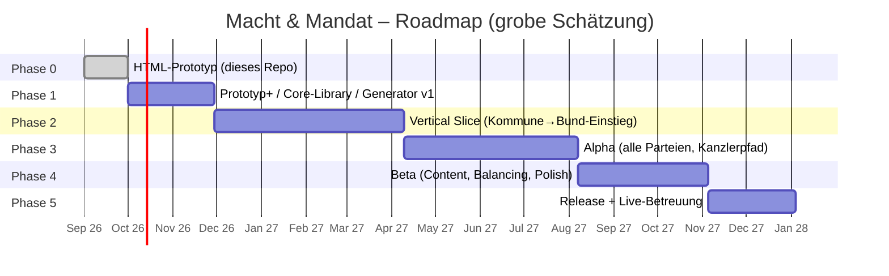

# 13 · Technische Architektur und Datenmodell
# 14 · Roadmap: Prototyp, Vertical Slice, Release

---

# 13 · Technische Architektur

## 13.1 Engine-Entscheidung

Das Spiel ist **UI-lastig** (Karten, Diagramme, Text), hat **2D-Cutscenes** (Kameras, Mimik) und eine **deterministische Simulation** als Herz. Bewertung (1 = schwach … 5 = stark):

| Kriterium | Godot 4 | Unity | Flutter | React Native |
|---|:-:|:-:|:-:|:-:|
| 2D-Cutscenes, Animation (Timeline) | **5** | 4 | 3 (Rive/Lottie) | 2 |
| UI-Widgets, Text, Serifen, Blur-Effekte | 4 | 4 | **5** | 4 |
| Barrierefreiheit (Screenreader, Dynamic Type) | 3–4 (neuere Versionen mit AccessKit) | 3 | **5** | 4 |
| Performance auf Mittelklasse (60 FPS) | **5** | 4 | 5 | 4 |
| Binärgröße / Startzeit | **5** (≈ 25–45 MB) | 2 (≈ 60–120 MB) | 4 | 4 |
| Lizenz / Kosten | **5** (MIT) | 3 (Laufzeitgebühren-Risiko der Vergangenheit) | 5 | 5 |
| Dialog-/Timeline-Tools, Lokalisierung | 4 (Dialogic/Yarn, `TranslationServer`) | 4 | 3 | 3 |
| Offline, Save, Determinismus | 4 | 4 | 4 | 4 |
| Team-Know-how (Annahme: Spiele-Team) | 4 | 4 | 3 | 3 |
| **Summe** | **39** | 32 | 37 | 32 |

**Empfehlung:** **Godot 4** (GDScript für UI/Flow, **C#** oder **GDExtension (Rust)** für die Simulation) – kleine Builds, starke 2D-/Animations-Toolchain, offene Lizenz. **Alternative:** *Flutter* als UI-Shell, falls Barrierefreiheit/Systemintegration im Vordergrund steht und das Team Web-/App-Erfahrung hat. Der Prototyp (HTML/JS) bleibt **Referenzimplementierung und Balancing-Labor**.

**Kernprinzip: Simulation ≠ Darstellung.** Die Spiellogik ist eine **headless-fähige Bibliothek** ohne Engine-Abhängigkeit (deterministisch, getestet). UI und Cutscenes sind austauschbare Schichten.

## 13.2 Schichtenarchitektur

```mermaid
flowchart TB
  subgraph UI["Präsentation (Godot Scenes)"]
    SC[Screens: Karten, Umfragen, Plenum, Wahlabend …]
    CU[Cutscene-Player]
    AV[Avatar-Renderer]
    AU[Audio · Haptik]
  end
  subgraph APP["Anwendung"]
    FL[Flow / Navigation]
    LOC[Lokalisierung · Text-Engine]
    SV[Save / Load · Migration]
    AN[Telemetrie (opt-in)]
  end
  subgraph CORE["Simulation-Core (engine-unabhängig, deterministisch)"]
    EV[Event-Engine<br/>Pools, Gewichtung, Ketten]
    PO[Umfrage-Engine<br/>Latent, Institute, Wanderung]
    EL[Wahl-Engine<br/>MNL, Sainte-Laguë, Hochrechnung]
    PA[Parlament-Engine<br/>Gesetze, Abstimmung, Koalition]
    CH[Figur-/NPC-System<br/>Werte, Beziehungen]
    RNG[RNG-Streams<br/>events · polls · elections · parliament · cosmetics]
  end
  subgraph DATA["Daten (JSON / Ressourcen)"]
    TPL[Templates · Pools]
    PAR[Parteien · Milieus]
    LAW[Gesetze · Ressorts]
    TXT[Texte (.po/CSV)]
  end
  UI --> APP --> CORE --> DATA
  CORE -. Snapshot .-> SV
```

| Modul | Verantwortung | Schnittstelle |
|---|---|---|
| **Event-Engine** | Auswahl, Slots, Text, Optionen, Ketten | `next(state) → EventInstance`, `decide(state, event, option) → Outcome` |
| **Umfrage-Engine** | Latentes Modell, Institute, Erklärungen | `step(state, shocks)`, `poll(institute, scope) → PollResult` |
| **Wahl-Engine** | Kommune/Land/Bund, Hochrechnung | `simulate(ballot) → Result`, `projection(result, step)` |
| **Parlament-Engine** | Fraktionen, Gesetzgebung, Koalition | `vote(bill) → VoteResult`, `negotiate(round)` |
| **Figur/NPC** | Attribute, Beziehungen, Stress, Geheimnisse | `applyEffects`, `relationshipDelta` |
| **Save** | Serialisierung, Migration, Replays | `save(state)`, `load(blob)`, `migrate(v)` |

## 13.3 Determinismus und RNG

- Pro Bereich **eigener Seed-Strom**: `events`, `polls`, `elections`, `parliament`, `cosmetics` (z. B. Mimik). Ein Streuverlust in einem Bereich verändert die anderen nicht.
- `mulberry32`/`PCG32`, Seed wird im Save abgelegt; **Replay** = Startseed + Entscheidungsliste → identischer Verlauf (Grundlage für *Wahl-Duell gegen Freunde* und Ranglisten-Validierung).
- Zeit: ganzzahlige Wochen/Tage (kein Floating-Zeitdrift), Geldbeträge in Ganzzahl-Einheiten.

## 13.4 Datenmodell (JSON)

### Partei
```json
{
  "id": "GRUENE", "name": "Bündnis 90/Die Grünen", "kuerzel": "GRÜ",
  "farben": { "marke": "#46b762", "cb": "#009E73" },
  "logo": { "stil": "organisch", "sekundaer": "sonnenblume" },
  "werte": ["Nachhaltigkeit", "Bürgerrechte", "Europa"],
  "kernthemen": ["klim", "verk", "soz"],
  "profil": { "komp": [0.35, 0.45, 0.55, 0.80, 0.30, 0.50], "aff": [0.8, 0.3, -0.2, -0.4, -0.4, -0.2] },
  "start": { "bund": 12.0, "kasse_kommune": 20, "bekanntheit": 0.28, "beliebtheit": 37, "loyalitaet": 60, "schwierigkeit": 3 },
  "mechanik": { "id": "realo_fundi", "parameter": { "par": 2, "bel": -1, "schritt": 12 } },
  "fluegel": ["Realos", "Fundis", "Parteilinke"],
  "konflikt": "Kompromiss oder Prinzip",
  "ereignisse_bevorzugt": ["klim", "verk"],
  "medien_haltung": { "ausgaben": 0.4, "klima": 0.9, "sparen": -0.3 }
}
```

### Figur / Avatar / NPC
```json
{
  "id": "spieler", "name": "Mira Hollweg", "anrede": "frau",
  "hintergrund": "lehrer", "herkunft": "alt", "dialekt": "hoch", "alter": 38,
  "avatar": { "haut": 2, "gesicht": "oval", "frisur": "seit", "haarfarbe": 1, "kleidung": "anzug", "accessoire": "brille" },
  "attribute": { "cha": 53, "iq": 57, "dur": 45, "ehr": 49, "med": 45, "res": 45, "net": 47 },
  "werte": { "bel": 39, "par": 58, "kasse": 9, "med": 0, "wirt": 50, "umw": 50, "ges": 50, "stress": 25 },
  "profil": [0.55, 0.45, 0.45, 0.45, 0.45, 0.57],
  "milieus_bonus": { "fam": 0.06 },
  "versprechen": [ { "text": "Kita-Neubau", "karte": "EV-006", "woche": 6, "status": "offen" } ]
}
```
```json
{
  "id": "npc_kaemmerin", "name": "Brigitte Kowalczyk", "rolle": "Stadtkämmerin",
  "persoenlichkeit": ["pedantisch", "loyal"], "ziele": ["ausgeglichener Haushalt"],
  "geheimnisse": [ { "id": "nebenjob", "bekannt": false, "enthuellungsrisiko": 0.1 } ],
  "beziehung": 45, "faehigkeiten": { "haushalt": 0.8 }
}
```

### Gesetz
```json
{
  "id": "LAW-0042", "titel": "Planungsbeschleunigungsgesetz",
  "ressort": "Bauministerium", "phase": "ausschuss", "zustimmungspflichtig": false,
  "parameter": { "frist_monate": 12, "ausnahmen": 3, "kosten": 1.2 },
  "wirkung": { "wirt": 2, "umw": -1, "ges": 0 }, "streitgrad": 0.55,
  "abstimmung": { "gewissen": 0.3, "wahlkreis": 0.4 },
  "historie": [ { "woche": 14, "phase": "referentenentwurf" }, { "woche": 17, "phase": "kabinett" } ]
}
```

### Umfrage-Zustand
```json
{
  "woche": 312,
  "latent": { "CDU": 20.4, "CSU": 5.5, "SPD": 15.6, "AFD": 22.1, "GRUENE": 12.7, "FDP": 4.6, "LINKE": 6.9, "BSW": 4.1, "SONST": 8.1 },
  "zeitgeist": { "CDU": 0.3, "…": 0 },
  "ereignisse": { "CDU": -0.8, "…": 0 },
  "verlauf": [ { "woche": 286, "…": 0 } ],
  "institute": [ { "id": "kom", "n": 1500, "bias": { "CDU": 0.6 } } ]
}
```

### Savegame (versioniert)
```json
{
  "v": 3, "app": "0.4.0", "seed": 2026093011, "rng": { "events": 88123, "polls": 4521, "elections": 18, "parliament": 7 },
  "spieler": { "…": 0 }, "partei": "GRUENE", "amt": 2, "woche": 318,
  "deck": { "gedaechtnis": { "lastSeen": { "KOM-001": 140 }, "count": { "KOM-001": 2 }, "katRecent": [] }, "queue": [ { "id": "MED-002", "tag": 352 } ], "saldo": 1.8 },
  "flags": { "spendeGeheim": true },
  "umfrage": { "…": 0 }, "npcs": { "…": 0 }, "gesetze": [ ], "geschichtsbuch": [ ],
  "entscheidungen": [ { "woche": 301, "id": "KOM-001", "option": "b", "wagnis": null } ],
  "einstellungen": { "schrift": 16, "kontrast": 0, "farbenblind": 0 }
}
```

### Save-System
| Aspekt | Lösung |
|---|---|
| **Format** | JSON (gzip), Dateiendung `.mum`, Checksumme |
| **Zeitpunkt** | nach *jeder* Entscheidung (Auto-Save), zusätzlich bei Pause/Hintergrund |
| **Slots** | 3 Karrieren + 1 Auto-Slot; optional Cloud (Plattform-Dienste), Konfliktauflösung „neuerer Stand gewinnt, Nachfrage bei Abweichung > 3 Entscheidungen“ |
| **Migration** | Versionsnummer + Migrationsfunktionen `v1→v2→…`; unbekannte Felder bleiben erhalten |
| **Replay** | Seed + Entscheidungsliste → Wiedergabe/Validierung |
| **Sicherheit** | Integrität per Hash, keine sensiblen Daten; Ranglisten nur mit Replay-Verifikation auf dem Server |

## 13.5 Lokalisierung

- **Text-Tabellen** (`.po`/CSV) mit Schlüsseln; Templates referenzieren `text_id` statt Klartext.
- **Slots mit Kasus:** Pool-Einträge tragen Formen (`n,a,d`, später `g`); Englisch ignoriert sie.
- **Geschlechtergerechte Sprache:** Figur-Anrede (`frau/mann/div`) wählt Formen: *Bürgermeisterin / Bürgermeister / Bürgermeister:in*; Partner:innen-Namen sind neutral (*Sam*).
- **Pluralisierung/ICU:** „1 Stelle / 80 Stellen“; Zahlen und Währung per Locale.
- **Längenpuffer:** +35 % für andere Sprachen; UI reflowt.
- **Sprachausgabe:** Lokale TTS oder aufgenommene Stimmen (optional), pro Locale gemappt.
- **Erweiterung Englisch:** Fiktive Orte/Personen bleiben kulturell deutsch, Institute/Medien werden übersetzt.

## 13.6 Performance-Budget (60 FPS auf Mittelklasse)

| Bereich | Budget |
|---|---|
| Frame | 16,6 ms (Ziel 60 FPS), 8,3 ms CPU-Limit für Gameplay + UI |
| Simulationstick | < 5 ms (Wochen-Tick), Event-Generierung < 2 ms |
| Plenarsaal (630 Sitze) | 1 Draw-Call via MultiMesh/Atlas; Animationen nur Modulate |
| Avatare | Schichten als Atlas-Sprites (Skeleton2D) statt Vektor-Parsing zur Laufzeit |
| Glas-/Blur-Effekte | Shader mit Qualitätsstufen, Fallback auf halbtransparente Flächen |
| Speicher | < 300 MB, Texture-Atlas ≤ 2048², Audio-Streaming |
| Start | < 3 s Kaltstart, Save-Load < 500 ms |
| Paketgröße | ≤ 120 MB (Basis), Sprachen/Stimmen als optionale Pakete |
| Batterie | FPS-Drosselung bei statischen Screens (30 FPS), Haptik sparsam |

## 13.7 Werkzeuge und Pipeline

| Werkzeug | Zweck |
|---|---|
| **Event-Editor** (Web/Godot-Plugin) | Templates schreiben, Live-Vorschau mit Zufalls-Slots, Lint (`tools/eventgen.js → lint()`) |
| **Sim-Harness** (`tools/*.js`, später Headless-Godot/C#) | Balancing, Regression, Varianten-Zählung |
| **CI** | Lint → Unit-Tests (Core) → Headless-Sim (Zielwerte) → Build (Android/iOS) → Smoke-Test |
| **Telemetrie** (opt-in, DSGVO) | anonyme Ereignisse (Optionswahl, Abbrüche, Session-Länge) |
| **Content-Pipeline** | Templates → `.po` → Übersetzung → Build |
| **Qualitätssicherung** | Golden-Seed-Tests (`seed → Ergebnis`), Device-Labor, Barrierefreiheits-Audit |

## 13.8 Sicherheit, Recht, Plattform

- **Datenschutz:** keine personenbezogenen Daten im Standardbetrieb; Telemetrie opt-in; Kinder-/Jugendschutz (USK), kein Tracking in Minderjährigen-Kontext.
- **Politik-Inhalte:** fiktive Figuren, stilisierte Parteien, keine Wahlempfehlung; rechtliche Prüfung (Kunst-/Satire-Freiheit, Namens- und Markenrecht bei Parteilogos – Logos stilisiert/eigenständig); Store-Richtlinien für politische Inhalte vor Launch prüfen.
- **Anti-Cheat (Ranglisten):** Server validiert Replay (Seed + Entscheidungen), erlaubte Wertebereiche.
- **Monetarisierung:** Einmalkauf *oder* kosmetische Pakete, **kein Pay-to-Win**; Preisgestaltung transparent.

## 13.9 Prototyp-Architektur (Ist-Zustand)

```
macht-und-mandat/
├─ prototype/
│  ├─ index.html          ← Build-Ergebnis: eine Datei, offlinefähig
│  ├─ sw.js · manifest.webmanifest · icon.svg   ← PWA (Offline-Cache, „App installieren“)
│  └─ src/
│     ├─ template.html · style.css
│     └─ js/ 00-util · 10-data-parties · 11-data-world · 12-data-cards · 13-data-speech
│            20-engine-election · 30-avatar · 40-ui-core · 41-ui-start-party-avatar
│            42-ui-cards · 43-ui-polls · 44-ui-election · 45-ui-cutscene · 46-ui-speech
│            47-ui-end · 99-boot
├─ data/ pools.json · templates50.json        ← Generator-Daten (Kap. 7–9)
├─ tools/ eventgen · stats · balance-sim · balance-prototype · tune-prototype
│        examples · make-event-catalog · make-template-table · build-prototype
└─ docs/ 01 … 09
```
Bauen: `node tools/build-prototype.js` (fügt `src/` zu `index.html` zusammen). Zustand: `localStorage` (Auto-Save + Einstellungen).

---

# 14 · Roadmap

## 14.1 Überblick



## 14.2 Phasen, Umfang, Exit-Kriterien

| Phase | Dauer | Team (Richtwert) | Umfang | Exit-Kriterien |
|---|---|---|---|---|
| **0 · Prototyp** ✅ | 4 Wochen | 1–2 | Spielbarer HTML-Prototyp (dieses Repo): Start, Parteiwahl, Avatar, Bürgermeisterwahl (Kampagne, 10 Entscheidungskarten, Stichwahl), Sonntagsfrage, Wahlabend-Hochrechnung, Bundestagsrede, Cutscenes, Balancing-Werkzeuge | Fun-Test: Kern-Loop macht Spaß; Zahlen (Kap. 10) stimmen |
| **1 · Prototyp+** | 8 Wochen | 3–4 (Design, Code, UI, Writer) | Engine-Entscheidung (Godot), **Core-Library** (Event, Poll, Election), Generator v1 mit **300 Templates**, UI-Kit, Avatar-Sprite-Pipeline, Save-System | Headless-Sim reproduziert Kap.-10-Zahlen ±3 pp; Golden-Seed-Tests grün |
| **2 · Vertical Slice** | 4–5 Monate | 8–10 | Kommune + Land + Bundestag-Einstieg, **3 Parteien voll** (CDU, SPD, Grüne) + Rest leichtgewichtig, **Gesetzeseditor**, **Koalitionsverhandlung** (1 Szenario), **3 Cutscenes** in Produktionsqualität, **1 000 Templates**, Audio/Haptik, Barrierefreiheit-Audit | Playtest (n ≥ 30): ≥ 60 % schließen Stufe 1 ab, Session-Länge 4–8 min, Verständlichkeit Wahlsystem ≥ 4/5 |
| **3 · Alpha** | 4 Monate | 12–15 | alle 9 Parteien, Kanzlerpfad komplett, **2 000 Templates**, Plakat-/Spot-Editor, TV-Duell-Minispiel, Sankey, Skillbaum, Achievements, Englisch-Lokalisierung (Stufe 1) | Feature-komplett; Crash-Rate < 1 %; Balancing-Ziele Kap. 10 erfüllt |
| **4 · Beta** | 3 Monate | 12–15 | **3 000 Templates**, Balancing-Feinschliff, Telemetrie, Performance (60 FPS auf Mittelklasse), Store-Materialien, Soft-Launch (DACH) | D1-Retention ≥ 35 %, D7 ≥ 15 %, Session 5–8 min, keine Dominanz-Alarme |
| **5 · Release** | 2 Monate + Live | 8–10 | Launch (iOS/Android), Patches, saisonale Inhalte (z. B. „Haushaltswoche“, „Sommerloch“), kosmetische Pakete, Ranglisten, Wahl-Duell | Bewertung ≥ 4,4; Support-Last stabil |

**Gesamt:** ca. **18–20 Monate** bis zum Release, ca. **150–180 Personenmonate** (grobe Schätzung; Kosten hängen stark vom Team-Modell ab).

## 14.3 Content-Plan

| Meilenstein | Templates | Pools (Ort/Person/Firma) | Cutscenes | Nebenwege |
|---|--:|---|--:|---|
| Prototyp (jetzt) | 16 (+50 Generator-Demo) | 2 880 / 3 100 / 3 000 | 5 | – |
| Vertical Slice | 1 000 | 6 000 / 4 000 / 4 000 | 10 | Seitenwechsel |
| Alpha | 2 000 | 10 000 / 6 000 / 6 000 | 18 | + Europaparlament, Parteichef |
| Beta / Release | 3 000 | 12 000 / 8 000 / 8 000 | 25 | + Parteineugründung vertieft |

## 14.4 Risiken und Gegenmaßnahmen

| Risiko | Wahrscheinlichkeit | Wirkung | Gegenmaßnahme |
|---|:-:|:-:|---|
| **Politische Sensibilität** (Fairness, Hetzvorwürfe) | mittel | hoch | Darstellungsregeln (Kap. 3.0), Sensitivity-Reads, „Gleiche Chancen“-Preset, juristische Prüfung |
| **Content-Menge** (3 000 Templates) | hoch | hoch | Generator-Archetypen, Lint, KI-gestützte Entwürfe + Lektorat, Priorisierung nach Wahlkampf-Stufen |
| **Balancing-Komplexität** | mittel | mittel | Headless-Sim in CI, Zielwerte pro Partei, Telemetrie, Kalibrierungs-Offsets |
| **Scope Creep** (Gesetz, Koalition, Sankey …) | hoch | hoch | Vertical-Slice-Gates; Features nur mit Playtest-Nachweis |
| **Performance/Low-End** | mittel | mittel | Budget (13.6), Qualitätsstufen, Atlas-Avatare |
| **Store-Richtlinien (politische Inhalte)** | niedrig | hoch | frühzeitige Vorabprüfung, keine Wahlwerbung, klare Fiktionskennzeichnung |
| **Wahlrecht ändert sich** | mittel | niedrig | Regeln als Daten (Modus „Reform/Klassik“), Patchbar |
| **Retention (Session-Spiel)** | mittel | mittel | Cliffhanger, tägliche Herausforderungen, Geschichtsbuch, Szenarien |

## 14.5 KPIs

| KPI | Ziel (Beta) |
|---|---|
| Durchschnittliche Session | 5–8 Minuten |
| D1 / D7 / D30 Retention | ≥ 35 % / 15 % / 6 % |
| Abschlussquote Stufe 1 | ≥ 60 % |
| Crash-freie Sessions | ≥ 99,5 % |
| Option-Dominanz | keine Option > 60 % (Ausnahmen markiert) |
| Wiederholungs-Beschwerden | < 1 % der Sessions |
| Barrierefreiheit | WCAG-AA-Kontraste, Screenreader-Durchlauf bestanden |

## 14.6 Was jetzt im Repo liegt (Status)

| Bereich | Stand |
|---|---|
| Dokumentation (Kap. 1–14) | ✅ vollständig |
| Spielbarer Prototyp | ✅ `prototype/index.html` (Offline, mobil, 9 Parteien) |
| Generator-Referenz + 50 Templates + Pools | ✅ `tools/eventgen.js`, `data/` |
| Balancing-Werkzeuge | ✅ `tools/balance-sim.js`, `balance-prototype.js`, `tune-prototype.js` |
| Nächste Schritte | Engine-Entscheidung bestätigen → Core-Library portieren → Generator v1 (300 Templates) → Vertical-Slice-Planung |
